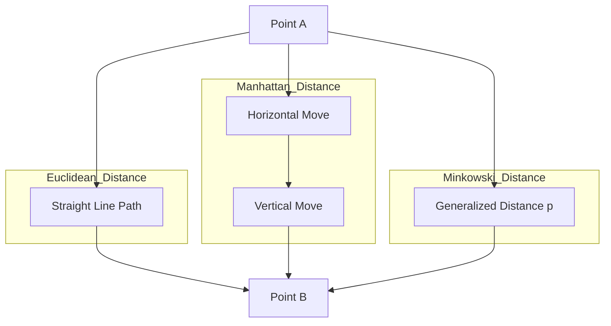

# Building Models with distance metrics and Nearest Neighbors

Will discuss models based on distance measures, such as K-nearest neighbor (KNN), convering theory, implementaion, and optimization, The exercises include building a KNN model on different datasets and adjusting parameters for optimal performance by the end of this -- should be able to understand the concept of *distance* in ML and master how to apply it in KNN.

#### Introduction to distance measurement - 

Distance measurement is a core component of many machine learning algorithms, especially those that rely on similarities or differences between data points. Understanding how to measure the distance between points in feature space is crucial for tasks such as -- 

*Clustering, Classiciation, Return* -- 

- Ecucidean
- Manhattan Distance
- Minkowske Distance -- 

Also provide practical examples of calculating these distances using scikit-learn and describe the relevant alg for using them.

##### Introduction to distance metrics

Distance metrics are fundamental comonent in many ML algorithms, particularly those that rely on the concept of similarity or dissimliarity between points. Understanding how to measure the distance between points in feature space is curcial for tasks such as clustering, classification, and regression. In this, will explore a variety of distance measures, including Euclidean, Manhattan, and Minkowski.

##### What is *distance* in ML -- 

In ML, we often need to understand how similar different data points in dataset are -- this is especially important in classicication problems, as we usually base ourselves on a hypothesis.

1. Euclidean Distance -- This is the most common *straight-line distance* In a two-dimensional coordinate system, the length of the direct connection between two points is Euclidean distance.
   - Continuous features
   - The geometric meaning is clear
   - Default selection
2. Manhatten Distance -- Think of it as working in a regular grid city, can use only move horizontally or verticaly, not diagonally.
   - The absolute value of the characteristic difference is more meaningful
   - More robust for outliers.
3. Minkowski Distance -- This is generalized form of Eucidean distance and Manhattan distance. By adjusting the parameters, can control how the distance is calcuated.

##### Practical use recommendations

In most cases, Euclidean distance is the default choice. But understanding the characteristics of each distance can help U make better judgements in specific tasks.



#### Understanding KNNS

The KNN alg is fundamental supervised learning techniques used for both classification and regression taks. The idea is siple -- if take our collection of existing data points and plot them in feature space before we are given a new data point. The K-Nearest Neighbor alg is a basic supervised learning technique that is suitable for classification and regression tasks.

The core idea is simple -- if we plot all existing that points in feature space, when we get a new data point, we use distance measures to estimate the properties of the new idea point based on the characteristics of existing data point closest to it.

In machine learning, the core of the *Nearest Neighbors* algorithm lies in the principle of *things cluster by like*. By calculating distance metrics between data points -- can quantify the similarites between samples and build predictive models based on them.

```py
from sklearn.neighbors import KNeighborsClassifier
from sklearn.metrics import accuracy_score

knn = KNeighborsClassifier(n_neighbors=3)
knn.fit(X_train, y_train)

y_pred = knn.predict(X_test)
print('Accuracy', accuracy_score(y_test, y_pred))
```

### Updating the code

```go
type Metadata struct {
	CurrentPage  int `json:"current_page,omitempty"`
	PageSize     int `json:"page_size,omitempty"`
	FirstPage    int `json:"first_page,omitempty"`
	LastPage     int `json:"last_page,omitempty"`
	TotalRecords int `json:"total_records,omitempty"`
}

func calculateMetadata(totalRecords int, page, pageSize int) Metadata {
	if totalRecords == 0 {
		// just returns an empty metadata struct without any pagination metadata
		return Metadata{}
	}

	return Metadata{
		CurrentPage:  page,
		PageSize:     pageSize,
		FirstPage:    1,
		LastPage:     (totalRecords + pageSize - 1) / pageSize,
		TotalRecords: totalRecords,
	}
}
```

### Paginating Lists

If have an endpoint which returns a list with hundreds or thousands of records, then for performance or usability reasons, you might to implement some of pagination on the endpont -- so that it only returns a subset of the records in a single HTTP response.

```go
// Return the 5 records on page 1 (records 1-5 in the dataset)
/v1/movies?page=1&page_size=5
// Return the next 5 records on page 2 (records 6-10 in the dataset)
/v1/movies?page=2&page_size=5
// Return the next 5 records on page 3 (records 11-15 in the dataset)
/v1/movies?page=3&page_size=5
```

Basilly, chainging the `page_size`parameter will alter the number of movies that are shown on ech `page`.

##### The Limit and OFFSET clauses

Behind the scenes, the simplest way to support this style of pagination is by adding `LIMIT`and `OFFSET`clasuses to our SQL query.

```sql
SELECT id, created_at, title, year, runtime, genres, version
FROM movies
WHERE (to_tsvector('simple', title) @@ plainto_tsquery('simple', $1) OR $1 = '')
AND (genres @> $2 OR $2 = '{}')
ORDER BY %s %s, id ASC
LIMIT 5 OFFSET 10
```

```go
func (m MovieModel) GetAll(title string, genres []string, filters Filters) ([]*Movie, Metadata, error) {
	// Create a context with 3s timeout.
	ctx, cancel := context.WithTimeout(context.Background(), 3*time.Second)
	defer cancel()

	query := fmt.Sprintf(`
		SELECT id, created_at, title, year, runtime, genres, version
		FROM movies
		WHERE (to_tsvector('simple', title) @@ plainto_tsquery('simple', $1) OR $1='')
		AND (genres @> $2 OR $2='{}')
		ORDER BY %s %s, id ASC
		LIMIT $3 OFFSET $4`, filters.sortColumn(), filters.sortDirection())

	rows, err := m.DB.QueryContext(ctx, query, title, pq.Array(genres), filters.limit(), filters.offset())
	if err != nil {
		return nil, Metadata{}, err
	}
	defer rows.Close()

	// Declare a totalRecords variable
	totalRecords := 0
	movies := []*Movie{}

	for rows.Next() {
		var movie Movie
		err := rows.Scan(
			&totalRecords,
			&movie.ID,
			&movie.CreatedAt,
			&movie.Title,
			&movie.Year,
			&movie.Runtime,
			pq.Array(&movie.Genres),
			&movie.Version,
		)
		if err != nil {
			return nil, Metadata{}, err
		}
		movies = append(movies, &movie)
	}

	if err = rows.Err(); err != nil {
		return nil, Metadata{}, err
	}

	metadata := calculateMetadata(totalRecords, filters.Page, filters.PageSize)
	return movies, metadata, nil
}
```

```tsx
export default function Home() {
    return(
        <main>
            <h2>
                Welcome to my blog!
            </h2>
        </main>
    )
}
```

#### Understandinng routs

A route is path in a web page that corresonds to a URL -- Next.JS has two types of routing systems -- the `page router`and *app router* -- will focus on the more recently released app router, which our projects has been confgirued with -- Routes defined using the folder structure in the `app`folder and a specified file called `page.tsx`. just like:

```ts
export const posts = [
    {
        id: 1,
        title: 'Understanding React Hooks',
        description:
            'A comprehensive guide to React Hooks and how they simplify state management in functional components',
    },
    //...
}
    
import {posts} from "@/data/posts";

export default function Posts() {
    return (
        <main>
            <h2>Posts</h2>
            <ul>
                {posts.map((post)=> (
                    <li key={post.id}>
                        <span> {post.title}></span>
                    </li>
                ))}
            </ul>
        </main>
    )
}
```

#### Creating navigation

Next.js has two ways to implement navigation, which we will cover in this section, as part of the learning process, we will update the blog posts list to include links to the associated `Post`page like: Using the `Link`component -- the `Link`component is the recommended way to perform navigation in Next.js -- Carry out the following steps to use this component in the `Posts`page -- like:

```tsx
export default function Posts() {
    return (
        <main>
            <h2>Posts</h2>
            <ul>
                {posts.map((post)=> (
                    <li key={post.id}>
                        <Link href={`/posts/${post.id}`}>
                            {post.title}
                        </Link>
                        <p>{post.description}</p>
                    </li>
                ))}
            </ul>
        </main>
    )
}
```

The route we have just referenced doesn't exist yet.
