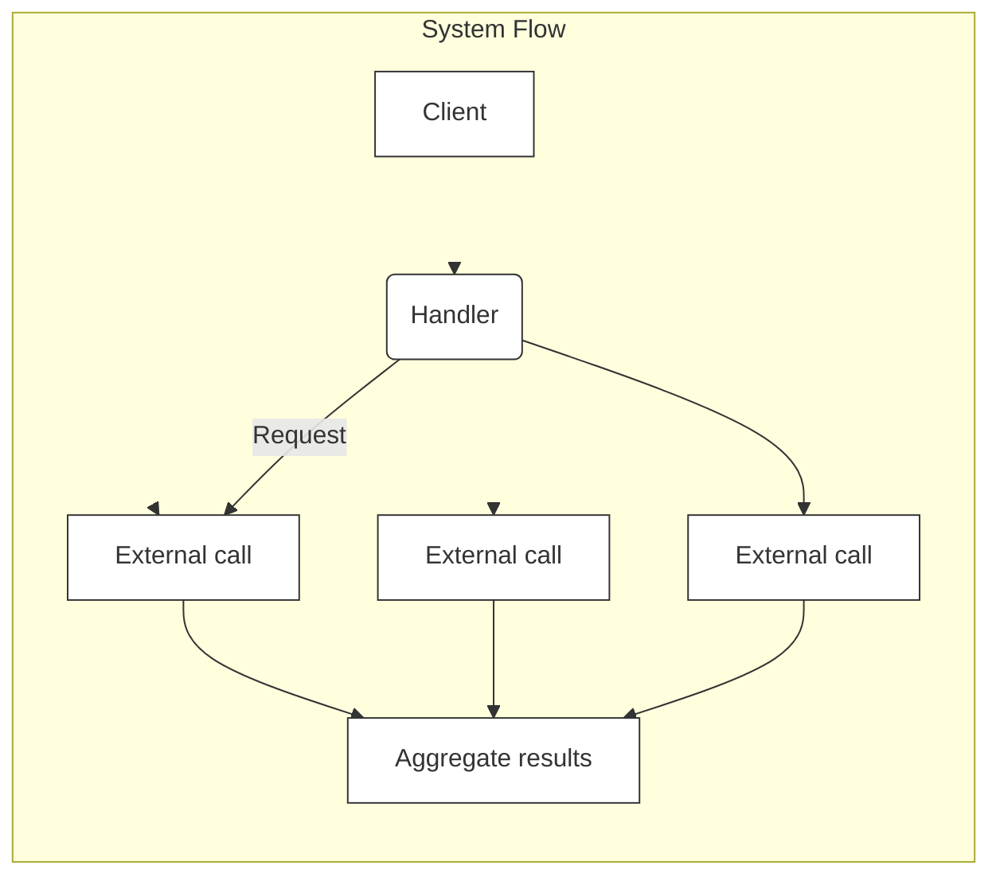

# Capped Collections

Caooed collections in MongoDB are collections of a fixed size that facilitate operations with the high throughput for inserting and retrieving documents according to the order of insertion -- They operate similarly to circular buffers. It accomodates new documents by replacing the oldest documents with the collection -- Capped collections ensure the maintenance of insertion order, eliminating the need for an index to retrieve documents in the order in which they were added.

#### Time-Series Collections

Are apecialized collections designed to effectively store and manage time-series data, which is data recorded at regular intervals, with each entry associated with a specific timestamp. Time-series collections store data in time order by grouping related data points in buckets based on time intervals and metadata. Like:

```js
db.createCollection('my_time_series_collection', {
    timeseries: {
        timeField: 'timestamp',
        metaField: 'metadata'
    }
})
```

#### Views

A Monbodb view is a querable, read-only entity defined through an aggregation pipeline applied to other collections or views -- Mdb doesn’t store the contents of view on disk. Instead, the content of a view is generated dynamically upon query by a client. Fore:

- Can create queryable entities that show only speciifc fields, hiding sensitive infor from certain users or apps
- Can simplify complex data structures by presenting only relevant info, allowing users to work with a more concise and understanable representation of the underlying collection.
- Can encapsulate frequently used complex queries
- Can combine info from multiple collections int a unifed result.

```js
use sample_training
db.createView(
    'aerocondorRoutesView', //name of the view
    'routes', // source collection
    [
        {
            $match: {'airline.id': 410}
        }
    ]
)
// then an use the view name to execute query like:
db.aerocondorRoutesView.find()
```

#### Working with documents

Mdb stores stores as document in BSON fomrat, which is an extension of JSON that includes additional data types. These documents are grouped in collections, The  maximum BSON document size is 16MB. And the maximum document size serves to prevent a single document from consuming an excessive amount of RAM or bandwidth during *tranmission.*, And documents can accommodate various data types - This flexibiility allows the storage of diverse information with a single document, making MDB suitable for handling complex data models.

Also, MDB documents are composed of field-and-value pairs. The values of a field can be any of the BSON data types -

```js
db.grades.findOne()
```

### Executing CRUD operations

*Inserts* are fundamental operations for adding data in Mdb -- offers the `insertOne`and `insertMany()`methods for inserting documents into a collection -- to insert a single document, using the `insertOne`like:

```js
db.routes.insertOne({
    "airline": {
        id: 410, name: 'Lufthansa', alias: 'LH',
        iata: 'DLH'
    },
    src_airport: 'MUC',
    dst_airport: 'JFK',
    codeshare: '',
    stops: 0,
    airplane: 'A380'
})
// then find recently inserted document like:
db.routes.find({}).sort({_id: -1}).limit(1)
```

And if need to insert multiple documents into a collection, use the `insertMany()`-- as can see

```js
db.routes.insertMany([
    {
        airline: {
            id: 413, name: 'American Airlines', alias: 'AA',
            iata: 'AAL'
        },
        src_airport: 'DFW',
        dst_airport: 'LAX',
        codeshare: '',
        stops: 0,
        airplane: '737'
    },
    {
        airline: {
            id: 411, name: 'British Airways', alias: 'BA',
            iata: 'BAW'
        },
        src_airport: 'LHR',
        dst_airport: 'SFO',
        codeshare: 'Y',
        stops: 0,
        airplane: '747'
    },
    {
        airline: {id: 412, name: 'Air France', alias: 'AF', iata: 'AFR'},
        src_airport: 'CDG',
        dst_airport: 'JFK',
        codeshare: '',
        stops: 0,
        airplane: '777'
    }
])
```

Uses the `insertMany()`method to bulk-insert multiple documents into the `routes`collection. This method is efficient cuz it performs the insertions in a single dbs operation. 

Also note that the number of documents U can include in a single `insertMany()`operation is constrained by the 16MB binary JSON document size limit.

## Using `errgoup`

Regardless of the programming language, reinventing the wheel is a rarely a good idea. It’s also prtty common for code bases to reimplement how to spin up multiple goroutines and aggregate the errors -- but  package in Go ecosystem is designed to support this frequently use case. Fore, `golang.org/x`is repository providing extensions to the stdlib. And the `sync`sub-repository contains a handy package `errgroup`.



For this, have to handle a function, and receive as an argument some data that we want to use to all an external service, due to constraints, can’t make a single call, we make multiple calls with a different subset eah time. In case of one error during a call, want to return it, in case of multiple errors, want to return only one of them -- 

```go
func handler(ctx context.Context, circiles []Circile) ([]result, error) {
    results := make([]Result, len(circiles))
    wg := sync.WaitGroup{}
    wg.Add(len(results))
    
    for i, cicle := range circles {
        i:=i
        circles := circle
        go func() {
            defer wg.Done()
            result, err := foo(ctx, circle)
            if err != nil {
                //?? what should do
            }
            results[i]=result
        }()
    }
    wg.Wait()
}
```

However, there is one case -- namely, what if `foo`returns an `error`-- How should we handle it -- 

- Could have a slice of errors shared among the goroutines, each goroutine would write to this slice in case of an error.
- Or have a single error variable accessed by the goroutine via a shared mutex
- Sharing a channel of errors, and the parent goroutine would receieve and handle these errors.

So, `errgroup`package -- it exports a single `WithContext`that returns a `*Group`struct tiven a context. This struct provides sync, error propagation, and context cancellation for a group of goroutines and exxports only two methos

- `Go`to trigger a call in a new goroutine
- `Wait`to block until all the goroutines have completed.

```go
func handler(ctx context.Context, circiles []Circile) ([]Result, error) {
    results := make([]Result, len(circiles))
    g, ctx := errgroup.WithContext(ctx)
    wg.Add(len(results))
    
    for i, cicle := range circles {
        i:=i
        circles := circle
        g.Go(func() error {
            result, err := foo(ctx, circle)
            if err != nil {
                return err
            }
            results[i]= result
            return nil
        })
    }
    if err := g.Wait(); err != nil { // allow us to wait for all the gorotuines to complete
        return nil, err
    }
    return results, nil
}
```

So the `golang/org/x/sync/errgroup`package provides a simplified way to manage a group of goroutines, collect the *first non-nil error* from any of them, and optionally use a `context.Context`to *cancel all remaining* goroutines immediately upon the first error. Should note that it is essentially a `sync.WaitGroup`with builtin error and context propagation.

```go
func main() {
	var urls = []string{
		"http://www.baidu.com/",
		"http://www.sina.com/",
		// This URL is deliberately invalid and will cause an error
		"http://www.somestupidname.com/",
	}

    // creates a new grop
	var g errgroup.Group

	for _, url := range urls {
		// create a local var for the closure -- crucial!!!
		url := url
         // Runs a function in a new goroutine
        // and expects it to return an error
		g.Go(func() error {
			resp, err := http.Get(url)
			if err != nil {
				// if an error occurs, it is returned by the Go goroutine
				return fmt.Errorf("error fetching %s: %v", url, err)
			}
			defer resp.Body.Close()
			fmt.Printf("✅ Successfully fetched %s with status %s\n", url, resp.Status)
			return nil // nil error means no error
		})
	}

    // blocks until all goroutines added via the `Go` have finished
	if err := g.Wait(); err != nil {
		fmt.Printf("❌ An error occurred: %v\n", err)
		return
	}
	fmt.Println("✅ All done!")
}
```

#### Example with `WithContext`(fail-fast)

This is the preferred pattern for server requets or tasks where a single failure invalidates the rest of the work.

```go
func main() {
	// create the group and a derived context
	ctx, cancel := context.WithTimeout(context.Background(), 5*time.Second)
	defer cancel()
	g, ctx := errgroup.WithContext(ctx)

	// Task 1, Runs for 3 s and is successful
	g.Go(func() error {
		select {
		case <-time.After(3 * time.Second):
			fmt.Println("Task 1 finished successfully")
			return nil
		case <-ctx.Done():
			fmt.Println("Task 1 canceled early")
			return ctx.Err()
		}
	})

	// Task 2, fails immediately after 1s
	g.Go(func() error {
		time.Sleep(1 * time.Second)
		fmt.Println("Task 2 ok, triggering cancellation.")
		return fmt.Errorf("task 2 failed due to database error")
	})

	// task 3, runs for 5 s, but will be canceled --
	g.Go(func() error {
		select {
		case <-time.After(5 * time.Second):
			fmt.Println("Task 3 finished successfully")
			return nil
		case <-ctx.Done():
			fmt.Println("Task 3 canceled early")
			return ctx.Err()
		}
	})

	// Wait for all finish
	if err := g.Wait(); err != nil {
		fmt.Printf("❌ An error occurred: %v\n", err)
		return
	}
}
```

For this, the output order you are seeing is a result of goroutine scheduling, context cancellatin. For this, if any task returns a non-nil error, the shared context is canceled.

### Pipelining with channels and goroutines

The first step in the app is go generate URLs of web pages that we can download later, can have a goroutine generate several URLs and send them on a channel to be consumed. Fore an implementation of the `generteUrls()`function, which creates a goroutine that generates URL strings on an toutput channel. Fore:

```go
func generateUrls (quit <-chan struct{}) <-chan string {
    urls := make(chan string)
    go func() {
        defer close(urls)
        for i:=100; i<=130; i++ {
            url := fmt.Sprintf("https://...%d.txt", i)
            select {
            case urls <-url:
            case <-quit:
                return
            }
        }
    }()
    return urls
}
```

Create the `quit`channel and then call `generateUrls()`-- which returns the goroutine’s output channel, then listen to both the output and the `quit`channel.

Then implement the `downloadPages()`function -- it accepts both the `quit`and `urls`channels, and returns an output channel contaiing the downloaded pages.

```go
func downloadPages(quit <-chan int, urls <-chan string) <-chan string {
    pages := make(chan string)
    go func() {
        defer close(pages)
        moreData, url := true, ""
        for moreData {
            select {
            case url, moreData = <-urls:
                if moreData {
                    resp, _ := http.Get(url)
                    if resp.StatusCode != 200 {
                        panic("...")
                    }
                    body, _ := io.readAll(resp.Body)
                    pages <- string(body)
                    resp.Body.Close()
                }
            case <-quit:
                return
            }
        }
    }()
    return pages
}
```

### Using `nil`channels

A common mistake while working with Go and channels is forgetting that `nil`channels can sometimes be helpful -- so what are `nil`channels, and why should we care about tham --  fore:

```go
var ch chan int
<-ch // won't panic, but block forever
```

And note that the principle is the same if we send a message to a `nil`channel -- blocks forever

```go
var ch chan int
ch <- 0
```

Then, what is the purpose of Go allowing messages to be received from or sent to a `nil`channel -- If write like:

```go
func merge (ch1, ch2 <-chan int) <-chan int {
    ch := make(chan int, 1)
    go func() {
        for {
            select {
            case v := <-ch1:
                ch <- v
            case v := <-ch2:
                ch <- v
            }
        }
        // unreachable
        close(ch)
    }()
    return ch
}
```

note that, looping over a channel using a `range`operator breaks when the channel is just *closed* -- however, the way we implemented a `for/select`doesn’t catch when either `ch1`or `ch2`is closed. Eve worse, if at some point ch1 or 2 is closed, here is what a receiver of the merged channel will receive when logging value 0.

Cuz in this form, the `select`doesn’t automatically detect when a channel is closed and continue to the next iteration or exit the loop.

So just like:

```go
func merge(ch1, ch2 <-chan int) <-chan int {
	ch := make(chan int) // Unbuffered is fine for this pattern

	go func() {
		defer close(ch) // Ensure the output channel is closed

		for ch1 != nil || ch2 != nil {
			select {
                // for select, when ch1 is nil, disable this case
			case v, ok := <-ch1:
				if !ok {
					// ch1 is closed, set ch1 to nil to disable this case
					ch1 = nil
					fmt.Println("ch1 closed.")
					continue // Go to the next select iteration
				}
				ch <- v // ch1 is open, send value
			
			case v, ok := <-ch2:
				if !ok {
					// ch2 is closed, set ch2 to nil to disable this case
					ch2 = nil
					fmt.Println("ch2 closed.")
					continue // Go to the next select iteration
				}
				ch <- v // ch2 is open, send value
			}
		}
		// Loop terminates when both ch1 and ch2 are nil (closed)
	}()
	return ch
}
```

Just like before, can conitnue reading from the input channel until we get a close on the input or on the `quit`channel, do this by using the `select`statement and reading the `moreData`flag on the input channel -- just like:

```go
func extractWords(quit <-chan struct, pages <-chan string) <chan string {
    words := make(chan string) 
    go func() {
        defer close(words)
        wordRegex := regexp.MustCompie('[a-zA-Z]+')
        moreData, pg = true, ""
        for moreData {
            select {
            case pg, moreData = <-pages:
                if moreData{
                    for _, word := range wordRegex.FindAllString(pg, -1) {
                        words <- strings.ToLower(word)
                    }
                }
            case <-quit:
                return
            }
        }
    }()
    return words
}
```

#### Comparison to `nil`channel strategy --   

The `nil`channel strategy is primarily used in `select`loops to disable a specific case indefinitely when you can’t simply break the loop after a channel closed -- like in the `merge`function where U had to wait for both channel to close. And in the `exactWords`func -- 

- The goal is to stop processing when pages closes
- The `moreData`already serves as the clean flag to exit the `for`loop.

And for this, if you were to set `pages=nil`after receiving `moreData=false`.

So this pipeline pattern gives us the ability to easily plug executions gotegher, each execution is reprsented by a function that starts a goroutine accepting input channels as arguments and returning the output channels as return values.