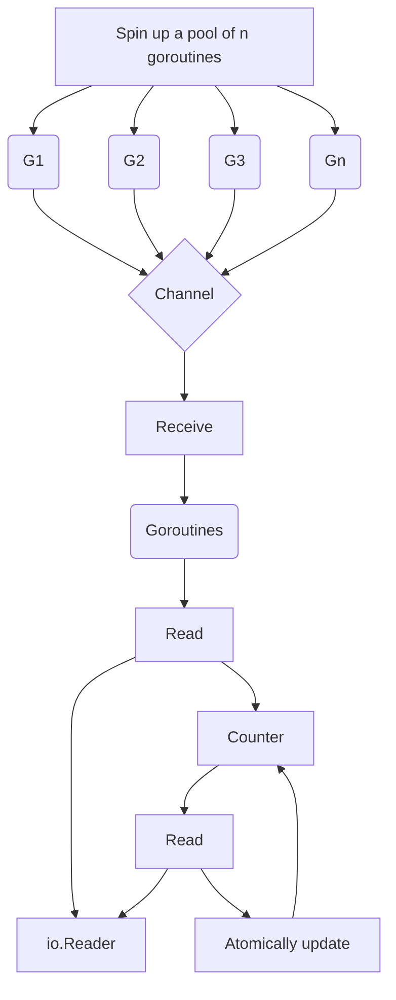

# Concurrency impacts of a workload type

Looks at the impacts of a workload type in a concurrent implementaiton. Depending on whether a workload is CPU- or I/O-bound, may need to tackle the problem differently. First define these concepts and then discuss the impacts. In programming, the execution time of a workload is limited by one of the following -- 

- The speed of the CPU -- FORE, running a merge sort alg, the workload is called CPU-bound
- The speed of I/O -- fore, making a *REST* call or a dbs query. The workload is called *I/O-bound*.
- The amount of available memory -- the workload is called memory-bound.

The following implments a `read`func that accepts an `io.Reader`andreads 1024 from it repeatedly pass these 1024 bytes to a `task`function that performs some taks. The `task`function returns an integer, we have to return the sum of all the results - here is a squential imp -- 

```go
func read(r io.Reader) (int, error) {
    count := 0
    for {
        b := make([]byte, 1024)
        _, err := r.Read(b)
        if err != nil {
            if err == io.EOF {
                break
            }
            return 0, err
        }
        count += task(b)
    }
    return count, nil
}
```

This function creates a `count`variable, reads from the `io.Reader`input, calls `task`, and increments `count`. Now what if we want to run all the `task`functions in a parallel manner.



First, spin up a fixed pool of goroutines -- then we create a shared channel to which we publish tasks after each read to the `io.Reader`. Each goroutine from the pool receives from this channel, performs its work, and then atomically updates a shared counter. Here is a possible way to write In Go - with a pool size of 10 goroutines.

```go
func read(r io.Reader) (int, error) {
    var count int64
    wg := sync.WaitGroup{}
    var n = 10
 
    // Creates a channel with a capacity equal to the pool
    ch := make(chan []byte, n)        
    wg.Add(n)   // Adds n the wait group         
    for i := 0; i < n; i++ {          
        go func() {
            defer wg.Done()  // Calls the Done 
            for b := range ch {   // each gorotuine receives from the shared every read    
                v := task(b)
                atomic.AddInt64(&count, int64(v))
            }
        }()
    }
 
    for {
        b := make([]byte, 1024)
        // Read from r to b
        ch <- b  // Publishes a new task to the channel after every read      
    }
    close(ch)
    wg.Wait()  // Waits for the `wait` group to complete before returning             
    return int(count), nil
}
```

Use `n`to define the pool size. Create a channel with the same capacity as the pool and a wait group with a delta of `n`-- This way, we reduce potential contention in the parent goroutine while publishing messages. Iterate `n`times to create a new goroutine that receives from the shared channel. Each message receives is handled by executing `task`and incrementing the shared counter atomically.

So, what's the rationale for mapping the size of the pool to `GOMAXPROCS`-- take a concrete example and say that we will run our application on a 4-core machine.

### Misunderstanding Go contexts

Developers sometimes misunderstand the `context.Context`type despite it being one of the key concepts of the language and a foundation of concurrent code in Go -- look at this concept and be sure we understand why and how to use it efficiently.

#### DeadLine

A deadline refers to a specific point in time determined with one of the following -- 

- A `time.Duration`from now
- A `time.Time`

The semantics of deadline convey that an ongoing activity should be stopped if deadline is met. An activity is, fore, an I/O request or a goroutine waiting to receive a message from a channel. Once we receive a position, want to share it with other applications that are only interested in the latest position.

```py
type publisher interface {
    Publish(ctx context.Context, position flight.Position) error
}
```

Assuming we don't receive an existing context, what should we provide to the `Publish`method for the conent argument -- have mentioned that the apps are interested only in the latest position.

```go
type publishHandler struct {
    pub publisher
}
 
func (h publishHandler) publishPosition(position flight.Position) error {
    // creates the context will time out after 4 seconds
    ctx, cancel := context.WithTimeout(context.Background(), 4*time.Second) 
    
    // defer the cancellation
    defer cancel()           
    
    return h.pub.Publish(ctx, position)                                     
}
```

This code creates a context using the `context.WithTimeout`function. This function accepts a timeout and a context. Here, as `publishPosition`doesn't receive an existing context, we create one from an empty context with `context.Background`. Meanwhile, `context.WithTimeout`returns two variables -- the conext creaed a cancellation `func()`function that will cancel the conext once called.

What is rationale for calling the `cancel()`function as a `defer`function -- Internally, `contxt.WithTimeout`creates a goroutine that will be retained in memory for 4s or until `cancel`is called.

##### Cancellation Signals

Another use case for Go context is to carray a cancellation signal. Let's imagine that we want to create an application that calls `CreateFileWatcher`-- `(ctx context.Context, filename string)`-- within another goroutine -- this function creates a specific file wather that keeps reading from a file and catches updates. Finally, when `main`returns, want things to be handled gracefully by closing this file descriptor. Need to propagate a signal.

```go
func main() {
    ctx, cancel := context.WithCancel(contxt.Background())
    defer cancel()
    
    go func() {
        CreateFileWather(ctx, "foo.txt")
    }()
}
```

##### Context values

The last use case for Go contexts is to array a k-v list.

```go
ctx := context.withValue(parentCtx, "key", "value")
```

Just like `context.WithTimeout`, `context.WithDeadline`, and `context.WithCancel`, `context.WithValue`is created from a parent context. In this case, create a new `ctx`contxt containing the same characteristics as `parentCtx`. Another example is if we want to implement an HTTP middleware.

```go
type key string
 
// Creates the context key
const isValidHostKey key = "isValidHost"                                    
 
func checkValid(next http.Handler) http.Handler {
    return http.HandlerFunc(func(w http.ResponseWriter, r *http.Request) {
        validHost := r.Host == "acme"     
        // checks whether the host is valid
        ctx := context.WithValue(r.Context(), isValidHostKey, validHost)    
 
        next.ServeHTTP(w, r.WithContext(ctx))                               
    })
}
```

##### Catching a context cancellatin

The `context.Context`type exports a `Done`method that returns a receive-only notification channel, `<- chan struct{}`-- this channel is closed when the work associated with the context should be canceled.

- The `Done`channel related to a context created with `context.WithCancel`is closed when the `cancel`function is called.
- The `Done`channel related to a context created with `context.WithDeadline`is closed when the deadline has expired.

```go
func handler(ctx context.Context, ch chan Message) error {
    for {
        select {
        case msg := <-ch:
            // do something with msg
        case <-cxt.Done():
            return ctx.Err()
        }
    }
}
```

For this, create a `for`loop and use `select`with two cases - receiving messages from `ch`or receiving a signal that the context is done and we have to stop our job.

The core lesson here is about non-blocking concurrency in Go -- when writing functions that accept a `context.Context`, U must ensure that the context's lifecycle is respected during every potentially blocking operation.

- The problem -- Standard channel operations are blocking -- if the channel isn't ready and the context is canceled, the goroutine remains stuck leaking resources and failing to respond to the shutdown signal.
- The Solution -- Use a `select`block to wrap every channel operation.
  1. The actual channel task
  2. `ctx.Done()`channel, which signals that the operation should be aborted.
- The Result -- The function becomes *context-aware* returning an error immediately upon cancellation rather than waiting idefintely for a channel they may never be ready.

| **Approach**          | **Behavior**                      | **Impact**                                                   |
| --------------------- | --------------------------------- | ------------------------------------------------------------ |
| **Direct Channel Op** | `ch1 <- val`                      | Blocks until the channel is ready, ignoring context signals. |
| **Select-Wrapped**    | `select { case ch1 <- val: ... }` | Prioritizes whichever happens first: the work or the cancellation. |

#### Activating a User

In this chapter going to move on to the part of the activation workflow where we actually activate a user. But before we write any code -- like to quickly talk about the REL between users and tokens in our system.

What we have is known in relational dbs terms as one-to-many REL -- where one user may have many tokens, but a token can only belong to one user. When have a one-to-many REL like this, potentially want to execute queries against the REL from two different sides.

- Retreive the user associted with a token
- Retreive tokens assocaited with a user.

To implement these queries in your code, a clean and clear approach is to update your dbs models.

##### Creating the `activateUserHandler`

In order to do this, need to add a new `PUT /v1/users/activated`endpoint to our API.

1. The user submits the plaintext activation token to the `PUT /v1/users/activated`endpoint.
2. We validate the plaintext token to check that it matches the expected format, sending the client an error message if necessary.
3. We then call the `UserModel.GetForToken()`method to retrieve the details of the user associated with the provided token. If there is no matching token found, or it has expired, we send the client an error message.
4. We activate the associated user by setting `activated  = true`on the user record and update in our dbs.
5. We delete all activation tokens for the user from the `tokens`table. Can do this using the `TokenModel.DeleteAllForUser()`method that we made eariler.
6. We send the updated user details in a JSON response.

```go
func (app *application) activateUserHandler(w http.ResponseWriter, r *http.Request) {
    // Parse the plaintext activation from the request body.
	var input struct {
		TokenPlaintext string `json:"token"`
	}

	err := app.readJSON(w, r, &input)
	if err != nil {
		app.badRequestResponse(w, r, err)
		return
	}

    // Validate the plaintext token provided by the client
	v := validator.New()
	data.ValidateTokenPlaintext(v, input.TokenPlaintext)
	if !v.Valid() {
		app.failedValidationResponse(w, r, v.Errors)
		return
	}

	// Retrieve the details of the user associated with the token using the GetByToken() method.
    // If no matching record is found, then we let the client know that the token.
	user, err := app.models.Users.GetForToken(data.ScopeActivation, input.TokenPlaintext)
	if err != nil {
		switch {
		case errors.Is(err, data.ErrRecordNotFound):
			v.AddError("token", "invalid or expired activation token")
			app.failedValidationResponse(w, r, v.Errors)
		default:
			app.serverErrorResponse(w, r, err)
		}
		return
	}

	// update the user's activation status
	user.Activated = true

	// save the updated user record in our dbs
	err = app.models.Users.Update(user)
	if err != nil {
		switch {
		case errors.Is(err, data.ErrEditConflict):
			app.editConflictResponse(w, r)
		default:
			app.serverErrorResponse(w, r, err)
		}
		return
	}

	// if everything went successfully, then we delete all activation tokens for the user
	err = app.models.Tokens.DeleteAllForUser(data.ScopeActivation, user.ID)
	if err != nil {
		app.serverErrorResponse(w, r, err)
		return
	}

    // Send the updated user details to the client in a JSON response.
	err = app.writeJSON(w, http.StatusOK, envelope{"user": user}, nil)
	if err != nil {
		app.serverErrorResponse(w, r, err)
	}
}
```

If U try to compile the application at this point, you will get an error cuz the `UserModel.GetForToken()`method doesn't yet exist. This code implements a std User Activation logic. It updates the user's activation status by verifying the token provided by the client and cleans the relevant data.

1) The Workflow -- 
   - Parsing -- Use `app.readJSON()`to read the JSON data from the request body into the struct. If the JSON is formatted incorrectly, return a 400 *Bad Request*.
   - Format Validation -- Checks the apparent legitimac of the token through the validator. If not, return a 422 Unprocessable Entity without querying the dbs.
   - Dbs Lookup -- Calls `GetFroToken()`to find users who match the token and are part of the `ScopeActivation`.
2) Database lookup -- To find users who match the token and are part of the `ScopeActivation`.
   - Set the user's `Activated`field to `true`in memory
   - Call the `Update()`to save the changes back to the database.
   - `ErrEditConflict`is specifically handled to prevent multiple requests from modifying the same user informatino at the same time.
3) Cleanup -- After successful activation, call `DeleteAllForUser()`to delete all activation tokens for the user, ensuring that the token is *valid at one time* and preventing duplicate activation.

## Enhancing Components with hooks

Rendering is the heartbeat of a React application. When sth changes, the component tree re-renders, reflecting the latest data as a user interface. So `useState`has been our workhorse for describing how our components should be rendering.

#### Introducing `useEffect`

```tsx
function Checkbox() {
    alert(`checked: ${checked.toString()}`);
    const [checked, setChecked] = useState(false);

    useEffect(() => {
        alert(`checked: ${checked.toString()}`);
    });

    return (
        <>
            <input
                type="checkbox"
                value={checked}
                onChange={() => setChecked(checked => !checked)}
            />
            {checked ? "Checked" : "Not Checked"}
        </>
    );
}
```

#### The Dependency Array

`useEffect`is designed to work in conjunction with other stateful Hooks like `useState`and the heretofore unmentioned `useReducer`-- which we promise to discuss later in the chapter.

```tsx
function App() {
    const [val, set]= useState('');
    const [phrase, setPhrase] = useState('example phrase');

    const createPhrase = ()=> {
        setPhrase(val);
        set('');
    };

    useEffect(() => {
        console.log(`typing ${val}`);
    });
    useEffect(() => {
        console.log(`phrase ${phrase}`);
    });
    return(
        <>
            <label>Favorite phrase:</label>
            <input value={val}
                   placeholder={phrase}
                   onChange={(e) => set(e.target.value)} />
            <button onClick={createPhrase}>send</button>
        </>
    )
}
```

`val`is a state variable that represents the value of the input field. The `val`changes every time the value of the input field changes. We don't want every effect to be invoked on every render. Need to associate `useEffect`with specific data changes.

```jsx
useEffect(()=> {
    console.log(`typing "${val}"`);
}, [val]);

useEffect(()=> {
    console.log(`saved phrase: ${phrase}`);
}, [phrase]);
```

It's an array after all, so it's possible to check multiple values in the dependency array.

```jsx
useEffect(()=> {
    console.log("either val or phase has changed");
}, [val, phrase]);
```

If either of those values changes, the effect will be called again. It's *also* possible to supply an empty array as the second argument to a `useEffect`function.

```jsx
useEffect(()=> {
    console.log("only once after initial render");
}, []);
```

Since there are no dependencies in the array, the effect is invoked for the initial render -- No dependencies means no changes, so the effect will never be invoked again. Effects that are only invoked on the first render are extremely useful for initialization -- 

```jsx
useEffect(()=> {
    welcomeChime.play();
}, []);

// If U return a function from the effect
useEffect(()=> {
    welcomeChime.play();
    return ()=> goodbyeChime.play();
}, []);
```

This pattern is useful in many situations. Perhaps we will subscribe to a news feed on first render. Then we will unsubscribe from the news feed with the cleanup function. More specifically, start by creating a state value for `posts`and a function to change the value.

```jsx
const [posts, setPosts] = useState([]);
const addPost = post=> setPosts(allPosts=>[post, ...allPosts]);

useEffect(()=> {
    newsFeed.subscribe(addPost);
    welcomeChime.play();
    return ()=> {
        newsFeed.unsubscribe(addPost);
        goodbyeChime.play();
    };
}, []);
```

This is lot going to in `useEffect`-- might want to use a separate `useEffect`for the news feed events and another `useEffect`for the chime events.

```jsx
useEffect(()=> {
    newsFeed.subscribe(addPost);
    return ()=> newsFeed.unsubscribe(addPost);
}, []);

useEffect(()=> {
    welcomeChime.play();
    return ()=> goodbyeChime.play();
}, []);
```

What we are trying to create here is functionality for subscribing to a news feed that plays different jazzy sounds for subscribing, unsubscribing, and whenever there is a new post.

```jsx
const useJazzyNews = () => {
  const [posts, setPosts] = useState([]);
  const addPost = post => setPosts(allPosts => [post, ...allPosts]);

  useEffect(() => {
    newsFeed.subscribe(addPost);
    return () => newsFeed.unsubscribe(addPost);
  }, []);

  useEffect(() => {
    welcomeChime.play();
    return () => goodbyeChime.play();
  }, []);

  return posts;
};
```

#### Deep Checking Dependencies

So far, the dependencies we've added to the array have been strings. JS primitives like strings, booleans, numbers, etc., Are comparable.

```tsx
if("gnar" == "gnar") {
    console.log("gnarly!");
}
```

However, when we start to compare objects, arrays, and functions, the comparison is different.

```jsx
if([1,2,3] !== [1,2,3]) {
    console.log("but they are the same");
}
```

These arrays `[1,2,3]`and `[1,2,3]`are not equal, even though they look identical in length and in entries. This is cuz they are two different instances of a similar-looking array. If we create a variable to hold this array value and then compare, we'll see the expected output -- 

```jsx
const array = [1,2,3];
if(array===array) {
    console.log("Cuz it's the exact same instance");
}
```

In Js, arrays, objects, and functions are the same only when they are the exact same instance.

```jsx
const useAnyKeyToRender = ()=> {
    const [, forceRender] = useState();

    useEffect(() => {
        window.addEventListener('keydown', forceRender);
        return ()=> window.removeEventListener('keydown', forceRender);
    }, []);
}

const words = ['sick', 'powder', 'day'];

function App() {
    useAnyKeyToRender();
    useEffect(() => {
        console.log('RENDER');
    }, [words]);
    return <h1>Component</h1>
}
```

The depedency array in this case refers to on instance of `words`that's declared outside of the function.

```tsx
export function NewPost() {
    const [isMutating, setIsMutating] = useState(false);
    const [status, setStatus] = 
        useState<'pending' | 'error' | 'success'>('pending');
    async function handleSlick() {
        setIsMutating(true);
        const result = await createPost(
            'New Post',
            'New Post Description'
        );
        setStatus(result.ok ? 'success' : 'error');
        setIsMutating(false);
    }
    
    return (
        <div className="actions">
            <button type="button" onClick={handleSlick}>
                {isMutating ? 'Creating...' : 'Create Post'}
            </button>
            {status ==='error' && (
                <span role="alert">
                    An unexpected error occurred
                </span>
            )}
            {status === 'success' && (
                <span role="alert" className="success">
                    Post successfully created!
                </span>
            )}
        </div>
    )
}
```

##### Understanding a Server Function

A React server Function is exactly as the same suggests -- it's a function that executes on the server. A common use case is to execute a dbs mutation.

```tsx
export async function createPost(
    title: string,
    description: string,
) {
    let client: Client | undefined;
    let result: ResultSet | undefined;
    try {
        const client = createClient({
            url: process.env.DB_URL ?? '',
        });
        await client.execute({
            sql: 'INSERT INTO posts(title, description) VALUES (?, ?)',
            args: [title, description],
        });
    } catch {
        return { ok: false };
    } finally {
        if (client) {
            client.close();
        }
    }
    revalidatePath('/posts');
    return {
        ok: true,
        id: result ? result.lastInsertRowid : undefined,
    };
}
```

