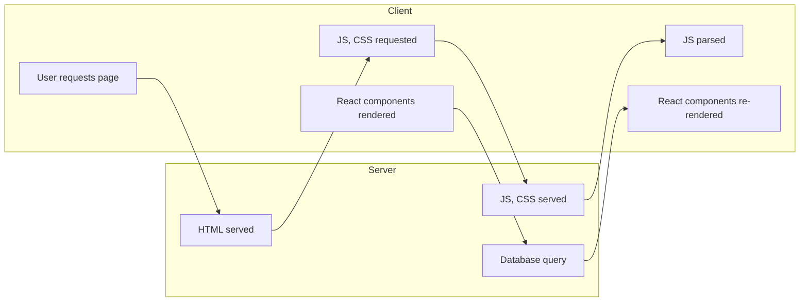

## Configuring the Rate Limiters

At the moment our request-per-second and burst values are hard-coded into the `rateLimit()`middleware. This is OK, but it would be more flexible if they were configurable at runtime instead. Likewise, it would be useful to have an easy way to turn off rate limiting altogether.

```go
type config struct {
	port int
	env  string
	db   struct {
		//...
	}

	// Add a new limiter struct containing fields for the requests.per-second and burst
	// values, and a boolean field we can use to enable/disable rate limiting altogether
	limiter struct {
		rps     float64
		burst   int
		enabled bool
	}
}

func main() {
    // Create command line flags to read the setting values into the config struct.
    // Notice that we use true as the default for the 'enabled' setting?
    flag.Float64Var(&cfg.limiter.rps, "limiter-rps", 2, "Rate limiter maximum requests per second")
    flag.IntVar(&cfg.limiter.burst, "limiter-burst", 4, "Rate limiter maximum burst")
    flag.BoolVar(&cfg.limiter.enabled, "limiter-enabled", true, "Enable rate limiter")
}
```

Then need to update our `rateLimit()`middleware to use these settings -- like -- 

```go
func (app *application) rateLimit(next http.Handler) http.Handler {
	// ...
	return http.HandlerFunc(func(w http.ResponseWriter, r *http.Request) {
		ip, _, err := net.SplitHostPort(r.RemoteAddr) // extract the client's IP
		if err != nil {
			app.serverErrorResponse(w, r, err)
			return
		}

		mu.Lock()
		if _, found := clients[ip]; !found {
			// Create and add a new struct to the map if it doesn't already exist
			clients[ip] = &client{
				limiter: rate.NewLimiter(rate.Limit(app.config.limiter.rps), 
                                         app.config.limiter.burst),
			}
		}

		// update the last seen time for the client
		clients[ip].lastSeen = time.Now()

		if !clients[ip].limiter.Allow() {
			mu.Unlock()
			app.rateLimitExceededResponse(w, r)
			return
		}
		mu.Unlock()
		next.ServeHTTP(w, r)
	})
}
```

### Graceful shutdown

We are going to talk about an important but often overlooked -- how safely stop your running application -- At the moment, when we stop our API app -- `Ctrl+C`it is terminiated *immediately* with no opportunity for in-flight HTTP requests to complete. This isn't ideal for two options.

- It means that clients won't receive response to ther in-flight requests, all they will experience is a hard closure of the HTTP connection.
- Any work being carried out by handlers may be left in an incomplete state.

We're going to mitigate these problems by ading *graceful shutdown* functionality to our app, so that in-flight HTTP requests have the opportunity to finish being processed *before* the app is terminated.

- Shutdown signals -- how to send them, and how to listen for them in your API application
- How to use these signals to trigger a graceful shutdown of the HTTP server using Go's `Shutdown`method.

##### Sending `Shutdown`Signals

When app is running, can terminate it at any time by sending it a specific `signal`-- A common way to do this, which probably been using, is by pressing `Ctrl+C`on your keyboard to send an interrupt signal -- `SIGINT`.

- `SIGINT`-- Interrupt from keyboard - `Ctrl+C`
- `SIGQUIT`-- QUit from keyboard -- `Ctrl+\`

It's important to explain upfront that some signals are *catchable* and others are not. Catchable signals can be intercepted by our app and either ignored. Can also try sending `SIGQUIT`signal -- either by pressing `Ctrl+\`on your keyboard or running `pkill -SIGQUIT api`-- will cause the application to exit with a stackdump. Can see that these signals are effective in terminating our application -- but the problem -- Go provides tools in the `os/signals`package that we can use to intercept catchable signals and trigger a graceful shutdown of your app, look at how to do that in the next chapter.

#### Intercepting Shutdown Signals

Move the code related to our `http.Server`out of the `main()`function and into a separate file - will give us a clean and clear starting from which we can build up the graceful shutdown functionlity.

```go
func (app *application) serve() error {
	srv := &http.Server{
		Addr:         fmt.Sprintf(":%d", app.config.port),
		Handler:      app.routes(),
		IdleTimeout:  time.Minute,
		ReadTimeout:  5 * time.Second,
		WriteTimeout: 10 * time.Second,
		ErrorLog:     slog.NewLogLogger(app.logger.Handler(), slog.LevelError),
    }
    // Likewise log a starting server message
    app.logger.Info("Starting server", "addr", srv.Addr, "env", app.config.env)
    
    // start the server as normal, returning any error
    return srv.ListenAndServe()
}
```

With this in place, can simply our `main()`function to use this new `app.serve()`method like so -- 

```go
func main(){
    //...
    app := &application {
        config: cfg,
        logger: logger,
        models: data.NewModels(db),
    }
    
    // call app.serve() to start the server.
    err = app.Serve()
    if err != nil {
        logger.Error(err.Error())
        os.Exit(1)
    }
}
```

##### Catching `SIGINT`and `SIGTERM`signals

The next thing we want to do is update our application so that it's catches any `SIGINT`and `SIGTERM`signals -- as we mentioend, `SIGKILL`signals are not catchable -- And will always cause the app to terminiate immediately. Will leave `SIGQUIT`with its default behavior. To catch the signals, need to spin up a background which runs for the lifetime of our application -- in this background goroutine, can use the `signal.Notify()`function to listen for specific signals and relay them to a channel for further processing. For the `Server.go`file just like:

```go
go func() {
    // start a quit channel which carries os.Signal values
    quit := make(chan os.Signal, 1)

    // Use signal.Notify to listen for SIGINT and SIGTERM
    // and relay them to quit, any another signals will not be caught by
    // signal.Notify
    signal.Notify(quit, syscall.SIGINT, syscall.SIGTERM)

    // Read the signal from the quit channel, will block until a signal is received
    s := <-quit

    // log a message to say that the signal has been caught
    // notice the `String()` method on the signal
    app.logger.Info("caught signal", "signal", s.String())

    // exit the app with a 0 (success) status code
    os.Exit(0)
}()
```

At the moment this new code -- after intercepting the signal, all we do is log a message and then exit our app, but the important thing is that it demonstrates the pattern of how to catch specific signals and handle them in your code -- One thing -- our `quit`channel is a buffered channel with size 1.

We need to use a buffered channel here cuz `signal.Notify`*does not wait* for a receiver to be available when sending a singla to the `quit`channel. If we had used a regular (non-buffered) channel here instead, a signal could be *missed* if our `quit`channel is not ready to receive at the exact moment that the signal is sent.

#### Executing the Shutdown

Intercepting the signals is all well and good -- not very useful until we do sth with them -- Going to update our app so that the `SIGINT`and `SITGERM`signals we intercept trigger a graceful shutdown or our API. Specifically, after receiving one of these signals we will call the `Shutdown`method on our HTTP server.

```go
func (app *application) serve() error {
	srv := &http.Server{
		Addr:         fmt.Sprintf(":%d", app.config.port),
		// ...
	}

	// create a shutdown channel, use this to receive any errors returned
	// by graceful  shutdown function
	shutdownError := make(chan error)

	go func() {
		// start a quit channel which carries os.Signal values
		quit := make(chan os.Signal, 1)
		signal.Notify(quit, syscall.SIGINT, syscall.SIGTERM)
		s := <-quit

		// log a message to say that the signal has been caught
		// notice the `String()` method on the signal
		app.logger.Info("caught signal", "signal", s.String())

		// create a context with a timeout of 30 seconds timeout
		ctx, cancel := context.WithTimeout(context.Background(), 30*time.Second)
		defer cancel()

		// call Shutdown() on the server to gracefully shutdown
		// shutdownError channel if it runs an error
		err := srv.Shutdown(ctx)
		if err != nil {
			shutdownError <- err
		}

		// log a message to say that we are waiting for any background goroutine to complete
		app.logger.Info("waiting for background goroutines to complete...")
		app.wg.Wait()
		shutdownError <- nil
	}()

	// Likewise log a string server message
	app.logger.Info("starting server", "addr", srv.Addr, "env", app.config.env)

	// Calling Shutdown() on the server will cause ListenAndServe() to immediately return
	// an http.ErrServerClosed error, so can see this error
	err := srv.ListenAndServe()
	if !errors.Is(err, http.ErrServerClosed) {
		return err
	}

	// otherwise, wait to receive value from Shutdown() on the shutdownError channel
	// if return value is an error, know that there was a problem
	err = <-shutdownError
	if err != nil {
		return err
	}

	// at this point, log a message to say that we're ready for the next one
	app.logger.Info("stopped server", "addr", srv.Addr)
	return nil
}
```

## Creating dynamic routes

State and properties have a REL with each other. When we work wtih React apps, we greacefully compose componetns that are tied together based on the REL. When the state of a component tree changes, so do the properties. Sould all be eating terrible food and watching terrible movies without the 5-star rating system.

```jsx
function App() {
  return (
    <StarRating />
  )
}

export default App

export default function StarRating() {
    return [
        <FaStar color="red" />,
        <FaStar color="red" />,
        <FaStar color="red" />,
        <FaStar color="grey" />,
        <FaStar color="grey" />,
    ]
}
```

And the 5-star rating system is pretty populare, but a 10-star rating system is far more detailed just like:

```tsx
const createArray = length => [...Array(length)];

export default function StarRating({totalStars=5}) {
    return createArray(totalStars).map((n,i)=>(
        <Star key={i} />
    ));
}

const Star = ({selected=false}) => (
    <FaStar color={selected?"red": "grey"} />
);
```

##### The `useState`Hook

It's time to make the `StarRating`component clickable, which will allow our users to change the `rating`. Since the `rating`is a value that will change, will store and change that value using `React`state -- incorporate state into a function component using a React feature called Hooks.

```tsx
export default function StarRating({totalStars=5}) {
    const [selectedStarts]= useState(3);
    return (
        <>
            {createArray(totalStars).map((n,i)=>(
                <Star key={i} selected={selectedStarts>i} />
            ))}
            <p>
                {selectedStarts} of {totalStars} stars
            </p>
        </>
    );
}
```

In order to collect a different rating from the user, we will need to allow them to click on any of our stars. This means we will need to make the stars clickable by adding an `onClick`handler to the `FaStar`component.

```tsx
const Star = ({selected=false,
              onSelect=f=>f}) => (
    <FaStar color={selected?"red": "grey"} onClick={onSelect} />
);
```

Here, modified the star to contain an `onSelect`property. The default value for this function is `f=>f`-- This is simply a fake function that does nothing.

```tsx
export default function StarRating({totalStars = 5}) {
    const [selectedStarts, setSelectedStars] = useState(0);
    return (
        <>
            {createArray(totalStars).map((n, i) => (
                <Star key={i} selected={selectedStarts > i}
                      onSelect={() => setSelectedStars(i + 1)}/>
            ))}
            <p>
                {selectedStarts} of {totalStars} stars
            </p>
        </>
    );
}
```

The React developer tools will show U which Hooks are incorporated with specific components. When we render the `StarRating`component in the browser, can view debugging information about the component by selecting it in the developer tools.

#### Refacting for Advanced reusability

The `Star`Component is ready fro production -- can use it acorss several applications when U need to obtain a rating from a user. If we were to ship this component to npm so that anyone in the world could use it to obtain ratings from users. May want to consider handling a couple more use cases.

```tsx
function App() {
  return (
    <StarRating style={{backgroundColor: 'lightblue'}}/>
  )
}
```

Then need to do it collect those styles and pass them down to the `StarRating`container.

```tsx
return (
        <div style={{padding: '5px', ...style}}>
            // ...
        </div>
    );
```

Additionally, may find developers who attempt to implement other common properties to the entire star rating:

```tsx
function App() {
    return (
        <StarRating style={{backgroundColor: 'lightblue'}}
                    onDoubleClick={e => alert('double click')}/>
    )
}

export default function StarRating({style = {}, totalStars = 5, ...props}) {
    const [selectedStarts, setSelectedStars] = useState(0);
    return (
        <div style={{padding: '5px', ...style}} {...props}>
            // ...
        </div>
    );
}
```

The first step is to collect any and all properties that the user may be attempting to add to the `StarRating`-- gather these properties using the spread operator.

#### Using search Parameters

*Search parameters* are part of a URL that comes after the `?`character and separated by the `&`character. In the following URL, `type`and `when`fore.

```tsx
export default async function Posts({searchParams}: {
    searchParams: Promise<{ [key: string]: string | string[] | undefined; }>;
}) {
    const criteria = (await searchParams).criteria;
    const resolvedPosts =
        typeof criteria === 'string' ? posts.filter((post) =>
            post.title.toLowerCase().includes(criteria.toLowerCase()),
        ) : posts;
    const resolvedHeading = typeof criteria==='string'
        ? `Posts for ${criteria}`: 'Posts';
    return (
        // ...
    )
}
```

### Server Component Data Fetching and Serve Function Mutations

Learn how React can fetch data from the server using a Server Component and take a look at the benefits of doing so. Will enhance the blog post app created in the last chapter to use data from a dataset to make the data interactions realistic, impement loading indicators and handlers along the way to ensure the user experience is great. Will learn about React Server function to mutate server data and use this knowledge to create new blog post data in our app.

##### Understanding Server-Side and Client-side data fetching -- 

Before implementing data fetching our app, will learn about the differences between client-side and server-side data fetching and the benefits of each approaches.

Client-side data fetching -- touched on the client-side data fetching process.



##### Server-side data fetching -- 

Server-side fetching happens when RSC is run on the server. Again, we touched on this process -- Using React Server and Client Components.

- The database query happens early the process while the RSC is run on the server.
- RSCs generally result in less JS being dowloaded than Client components. This not only means that the JS is downloaded faster, but also that it parsed faster.
- Fewer HTTP requests happen, if multiple RSCs fetch data, this all happens on the server in a single HTTP request. FORE, in the following `Home`RSC.

```tsx
async function Home() {
    const user = await fetchUser();
    return (
    	<main>
        	<h2>Welcome, {user.name}</h2>
            <TaskList userId= {user.id} />
        </main>
    );
}
async function TaskList({userId}: ...) {
    const tasks = await fetchTasks(userId);
    return <ul>...</ul>
}
```

##### Understanding the benefits -- 

Both server-side and client-side data fetching have benefits and downloads -- Here are the benefits of server-side data fetching -- 

- The user will see the data on the page quicker than client-side data fetching -- 
- RSCs have access to cookies -- allowing cookie-based authN and authZ checks.

Here are the benefits of client-side data fetching -- 

- Data can be refreshed without a full page load. A typical use case where data refreshing is required is a dashboard that needs to show up-to-date data.
- Data paging can be done without a full page load.
- Infinite scroll can only be done in a *Client Component*.
- *Component composition* and reuse are easier in a client component. This is cuz Client Component can fetch their own data, reducing the need for data to be passed in through props. This introduces a rigid top-down data flow.
- Client-side data fetching can be used with any web server framework - it doesn't have to support RSCs or even be based on Js.

##### Getting set up

In this section, will set up the code for the app we aill work on in this chapter, which is the blog app from the last chapter -- will also connect the app to a SQLite database.

Setting up the dbs -- SQLite is a SQL-based database engine that is simple to set up. We will use a popular fork of SQLite called `libSQL`that works nicely with `next.js`the dependency for `libSQL`is already installed.

```sh
npm i @libsql/client
```

Create a script that we will eventually run to create our dbs -- create a folder, called `scripts`in the `src`folder and then a file called `createDatabase.mjs`in the folder and copy the script.

```js
import { createClient } from '@libsql/client';
const client = createClient({
    url: 'file:src/data/blog.db',
});

await client.execute(
    `CREATE TABLE IF NOT EXISTS posts (
    id INTEGER PRIMARY KEY AUTOINCREMENT, 
    title STRING NOT NULL, 
    description STRING NOT NULL
  )`,
);

const posts = [
    {
        id: 1,
        title: 'Understanding React Hooks',
        description:
            'A comprehensive guide to React Hooks and how they simplify state management in functional components',
    },
   // ...
];

for await (const post of posts) {
    await client.execute({
        sql: 'INSERT INTO posts (id, title, description) VALUES (?, ?, ?)',
        args: [post.id, post.title, post.description],
    });
}
client.close();
console.log('Database created');
```

Then to create the dbs, run the following command in the terminal -- 

```sh
node src/scripts/createDatabase.mjs 
```

Excellent, that completes this section on setting up the project for this chapter -- quick recap - 

- Created a Next.js project using the `create-next-app`tool and copied code from the last chapter's app with some addition styles.
- Created `SQLite`database for blog post data and intalled a library that will eventually use to connect to it.

#### Fetching data using an RSC

In this section, will implement data fetching the blog list and blog post detail RSCs to get the data from our new database. We will structure the code that interacts with the dbs in separate functions -- will call the *query function*.

##### Implmenting query functions

First, we will implement functions to connect to the dbs query it to get the necessary data.

1. Will start by storing the path to the dbs in an environment variable. Create a file called `.env`in the project root with the following content -- `DB_URL=file:src/data/blog.db`

2. Create a file called `queries.ts`in the `src/data`folder. Add the following content to `queries.ts`to import a function from `libSQL`that will allow us to connect to the dbs.

   ```ts
   type Post = {
       id: number;
       title: string;
       description: string;
   };
   ```