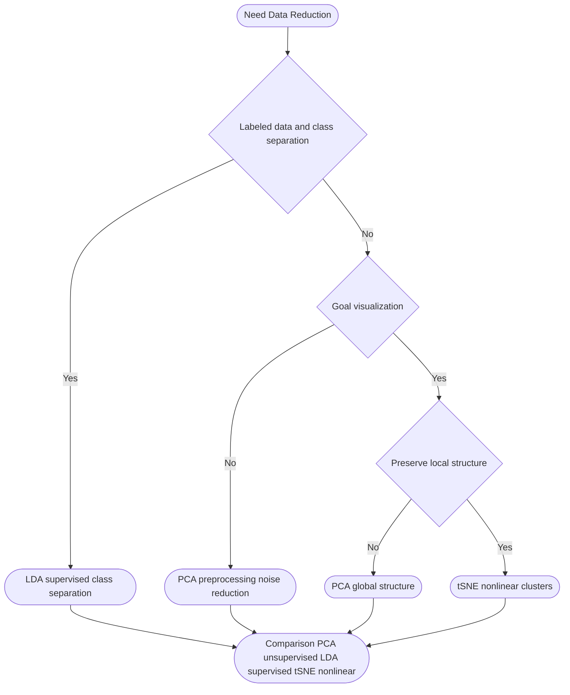

# Differences between PCA and LDA

While both PCA and LDA are used for dimensionality reduction, they have distinct objectives and methodologies.

- PCA is *unsupervised* method that focuses on maximizing variance without considering class labels. While LDA is *supervised* and seeks to *maximize* class separatbility using labeled data.
- PCA aims to retain as much variance as possible across all data points, whereas LDA aims to maximize the separation between differnet classes.

| Method                                 | Type         | What It Optimizes                                            | Uses Labels? | Intuition                                            |
| -------------------------------------- | ------------ | ------------------------------------------------------------ | ------------ | ---------------------------------------------------- |
| **PCA (Principal Component Analysis)** | Unsupervised | **Maximize total variance** in the data                      | ❌ No         | Find directions where data spreads out the most      |
| **LDA (Linear Discriminant Analysis)** | Supervised   | **Maximize class separability** (between-class variance / within-class variance) | ✔ Yes        | Find directions that best separate different classes |

- Output -- PCA generates principal componets that capture maximum variance; these componetns are orthogonal.  In contrast, LDA produces linear discriminants that are specifially desgiend to enhance class separability.
- User cases -- PCA used for explortary data analysis and feature extraction when class labels are not availalbe. In Contrast, LDA is primarily used for classification tasks where disguishing classes is essential.

Use cases -- When to use PCA or LDA -- 

- PCA -- No Label available, explortory data analysis, Noise extraction, visualization 2D/3D So, PCA is about structure. Namely, PCA finds directions of maximum variance -> unsupervised, orthogonal components.
- LDA -- Labels available - goal is classification - want features that maximize class separation - used before classifier like SVM regression, or KNN , SVM, KNN. LDA finds directions that best separate classes -- supervised, discriminative components.

### t-SNE and data visualization

t-SNE is technique for visualizaing high-dimensional data by mapping into a lower-dimensional space, typcially two or three dimensions, this method is particularly effective for revealing the underlying structure of complex datasets.

```python
from sklearn.datasets import load_digits
digits = load_digits()
```

| **Properties**        | **Description:**                             | **Shape**      |
| --------------------- | -------------------------------------------- | -------------- |
| `digits.data`         | Feature data for training (pixels flattened) | `(1797, 64)`   |
| `digits.images`       | Raw image data (matrix form)                 | `(1797, 8, 8)` |
| `digits.target`       | The correct numeric label for the image      | `(1797,)`      |
| `digits.target_names` | Category name (i.e., 0 to 9)                 | `(10,)`        |

Again, will use the `Pipeline()`class to sequentially apply data scaling prior to t-SNE. Fore:

```python
from sklearn.manifold import TSNE
from sklearn.pipeline import Pipeline
from sklearn.preprocessing import StandardScaler

tsne_pipeline = Pipeline([
    ('scaler', StandardScaler()),
    ('tsne', TSNE(n_components=2, random_state=2024))
])

X_tsne = tsne_pipeline.fit_transform(digits.data)
```

`X_tsne`, maps the original 64D 8x8 images data to a 2D coordinate matrix. It’s s NumPy array shped like (1797,2).

```python
import matplotlib.pyplot as plt

plt.figure(figsize=(10,8))
scatter = plt.scatter(
    # take out the two new coordinates after dimensionality reduction as X and Y axes
    X_tsne[:, 0], X_tsne[:, 1],
    
    # color according to the true category of the number
    c=digits.target, 
    
    # Paired to ensure that the 10 digital colors are clearly distinguished
    cmap='Paired',
    label=digits.target
)
plt.xlabel('t-SNE Component 1')
plt.ylabel('t-SNE Component 2')
plt.title('Digits Dataset - t-SNE Visualization')

legend_elements = [
    plt.Line2D(
        # incoming single point [0], [0]
        [0], [0], marker='o', color='w',
        markerfacecolor=plt.cm.Paired(i/9),
        label=str(i), markersize=10
    )
    for i in range (10)
]
plt.legend(
    handles=legend_elements,
    title='Digit', loc='center left',
    bbox_to_anchor=(1, 0.5)
)
```

Similar to LDA, t-SNE excels at class separation, even when the number of classes and underlying dimensions in our data grows -- in the case to 10 classes.

The goal of t-SNE is not to maintain geometric distance, but to maintain a simiarlity structure, it reconstructs the how is who rel in high-dimensional space in 2D or 3D as much as possible.

And the biggest significance of t-SNE is to compress dimensions of data into 2D or 3D space, and maintain the original relative relatinship between data ponts as much as possible. Before the advent of t-SNE, the most commonly used dimensionality reduction method was **PCA (principal component analysis).** But PCA is **linear**, and it focuses on global variance maximization. If high-dimensional  data is entangled like a ball of yarn (nonlinear structure), the various categories tend to overlap and become a mess after PCA dimensionality  reduction.

##### The visual verification of results -- 

- will observe that number that originally look alike in high-dimensional space fore 3, 8, 9 are sometimes smialr will show a certain aggregation tendency on the 2D map.
- Can see 10 colorful nubula like distributions.



```python
from sklearn.linear_model import SGDClassifier

sgd_clf = SGDClassifier(random_state=42)
sgd_clf.fit(X_train, y_train_5)

from sklearn.model_selection import cross_val_predict
y_train_pred = cross_val_predict(sgd_clf, X_train, y_train_5, cv=3)

from sklearn.metrics import confusion_matrix

cm = confusion_matrix(y_train_5, y_train_pred)
cm

from sklearn.metrics import f1_score
f1_score(y_train_5, y_train_pred)

y_scores = cross_val_predict(sgd_clf, X_train, y_train_5, cv=3,
                             method="decision_function")

from sklearn.metrics import roc_curve
fpr, tpr, thresholds = roc_curve(y_train_5, y_scores)
```

### Understanding the theoretic concept of ROC Curves

The ROC curve is simialr to the PR curve that we learned earlier. However, the PR curve plots the REL between accuracy and recall, while the ROC curve plots the REL between *true case rate* -- and *false positive case*.

- Aliases -- recall Sensitivity
- Meaning -- how many proportions of all samples that are actually positive that the classicfic correctly finds.

FPR -- False Positive Rate -- X -- Fall-out -- Meaning -- In all the samples that are actually negative, the classifier incorrectly identifies how many proportions are positive. - `FPR = 1- TNR`

1. Calculate the points needed to generate the curve -- 

   ```python
   from sklearn.metrics import roc_curve
   
   # y_train_5: 真实的标签 (例如：是否为数字 5 的布尔值)
   # y_scores: 模型预测每个样本属于正类的得分（或概率）
   fpr, tpr, thresholds = roc_curve(y_train_5, y_scores)
   ```

   `roc_curve()`-- does -- it automatically tries different classification threhold internally. For each threshold, it calculates a corresponding set of FPR and TPR.

   - `fpr`-- Array of false positive case at differnt thresholds
   - `tpr`-- Array of true case rates at different thresholds.
   - `thresholds`-- The thresholds array used.

2. ```python
   # 寻找达到90%精确率那个阈值在数组中的索引位置
   idx_for_threshold_at_90 = (thresholds <= threshold_for_90_precision).argmax()
   
   # 根据索引，取出对应的真正例率(TPR)和假正例率(FPR)
   tpr_90, fpr_90 = tpr[idx_for_threshold_at_90], fpr[idx_for_threshold_at_90]
   ```

   `thresholds`returned by `roc_curve`are arranged in descending order

   1. `thresholds <= threhold_for_90_precision` A Boolaen array is generated, such as `[False, True..]`. The first few extremely high threholds are greater than the target value.
   2. `.argmax()`-- returns the index of the *first maximum value* in the array.

```python
from sklearn.ensemble import RandomForestClassifier
forest_clf = RandomForestClassifier(random_state=42)
```

The `precision_recall_curve()`function expcets labels and scores for each instance, so need to train the random forest classifier and make it assign a score to each instance. But the `RandomForestClassific`class does not have a `decision_function()`method, due to the way it works.

```python
y_probas_forest = cross_val_predict(forest_clf, X_train, y_train_5, cv=3,
                                    method="predict_proba")
y_probas_forest[:2]

plt.figure(figsize=(6, 5))  # extra code – not needed, just formatting

plt.plot(recalls_forest, precisions_forest, "b-", linewidth=2,
         label="Random Forest")
plt.plot(recalls, precisions, "--", linewidth=2, label="SGD")

# extra code – just beautifies and saves Figure 3–8
plt.xlabel("Recall")
plt.ylabel("Precision")
plt.axis([0, 1, 0, 1])
plt.grid()
plt.legend(loc="lower left")
save_fig("pr_curve_comparison_plot")

plt.show()
```

## Filtering Lists

In tihs chapter we’re giong to start putting our query parameters to use, so that clients can search for movies with a specific title or genres -- Fore  `/v1/movies?title=moana&gerens=animation,adventure`.

#### Dynamic filtering in the SQL query -- 

The hardest part of building a dynamic filtering feature like this is the SQL query to retreive the data -- we need to work with no filters, filters on both `title`and `genres`-- or a filter on only one of them. To deal with this, one option is built up the SQL query dynamically at runtime -- with the necessary SQL for each filter concatenated or interpolated into the `WHERE`clause.  This approach can make your code messy and difficult to understand, exspecially for large queries which need to support lots of filter options.

```sql
SELECT id, created_at, title, year, runtime, genres, version
FROM movies
WHERE (LOWER(title) = LOWER($1) OR $1 = '')
AND (genres @> $2 OR $2 = '{}')
ORDER BY id
```

This SQl query is designed so that each of filters behaves like it is optional fore, the condition `(LOWER(title)=LOWER($1) OR $1='')`will evaluate as `true`if the placeholder parameter `$1`is case-insenstive match for the movie title *or* the placeholder parameter equals `‘’`. So this filter condition will essentially be *skipped* when movie title being searched for this empty string `“"`.

- `genres @> $2`-- The genres array in the dbs contains all the elements in `$2`.
- `OR $2 = '{}'`-- `{}`represents an empty array in PSQL. If the user does not select any type, an empty array is passed in from the backend.
- `@>`is a PSQL-Specific array containing operator -- means -- the movie genre array in the dbs must contain all the genres in `$2`-- the genres of the movie must contain `sci-fi`and `action`.

```go
func (m MovieModel) GetAll(title string, genres []string, filters Filters) ([]*Movie, error) {
    query := `
        SELECT id, created_at, title, year, runtime, genres, version
        FROM movies
        WHERE (LOWER(title) = LOWER($1) OR $1 = '')
        AND (genres @> $2 OR $2 = '{}')
        ORDER BY id`
    ctx , cancel := context.WithTime(context.Background(), 3*time.Second)
    defer cancel()
    
    rows, err := m.DB.QueryContext(ctx, query, title, pq.Array(genres))
    if err != nil {
        return nil, err
    }
    defer rows.Close()
    movies := []*Movies{}
    
    for rows.Next() {
        var movie Movie
        err := rows.Scan(
        	&movie.ID,
            // ...
            pq.Array(&movie.Genres),
            &movie.Version,
        )
        
        if err != nil {
            return nil, err
        }
        
        movies = append(movies, &movie)
    }
    
    if err = rows.Err(); err != nil {
        return nil, err
    }
    return movies, nil
}
```

```sh
curl "localhost:4000/v1/movies?title=black+panther"
curl "localhost:4000/v1/movies?genres=adventure"
curl "localhost:4000/v1/movies?title=moana&genres=animation,adventure"
curl "localhost:4000/v1/movies?genres=western"
```

#### Full-Text Search

In this -- going to make our movie title filter easier to use by adapting it to support *partial* matches -- rather than requiring a match on the full title -- fore, if a client wants to find the *Breakfast Club* they will be able to find it with just the query string `title=breakfast`.

There are a few different ways we could implement this feature in our codebase -- but an effective and intutive method is to leverage PostSQL’s full-text search functionality. Which allows U to perform *natrual language* searches on text fields in your dbs.

```sql
SELECT id, created_at, title, year, runtime, genres, version
FROM movies
WHERE (to_tsvector('simple', title) @@ plainto_tsquery('simple', $1) OR $1 = '')
AND (genres @> $2 OR $2 = '{}')
ORDER BY id
```

PSQL full-text search is powerful and highly-configurable tool -- and explaining how it works and the available options in full could easily take up a whole book in itself. So we will keep the explanation in this chapter high-level, and focuses on the practical imp -- 

##### Core concepts -- `tsvector`and `tsquery`-- 

PostgreSQL’s full-text search is based on two core data types -- 

- `tsvector`-- represents your document (data) -- it segments a piece of text, removes stop words, and extracts stemming -- `SELECT to_tsvector('english', 'The quick brown foxes are jumping');`FORE.
- Result -- `brown:3 fox:4 jump:7 quick:2`

```sql
to_tsvector('simple', 'The Breakfast Club')
```

For this, the simple configuration will not stop word filtering, will not stem words, and will only do -- word segmentation, all lowercase -- keep all words, therefore, the Breakfast club -- will be dismantled into `the`, `breakfast`, `club`. And `tsvector`will srot the lexemes alphabetically.

`@@`meaning - 

```sql
tsvector @@ tsquery
```

- `to_tsvector()`-- text is processed into word vectors
- `plainto_tsquery()`-- the search term is processed into a query structure.
- `@@`-- Judge if the two match

If search `breakfast`-- just like 

```sql
'breakfast' 'club' 'the' @@ 'breakfast'
```

| operator         | Type                     | behavior                                                  |
| ---------------- | ------------------------ | --------------------------------------------------------- |
| `ILIKE '%word%'` | String matching          | Slow and does not support stemming                        |
| `@@`             | Full-text search matches | Fast, support stemming, stop words, word order, weighting |

The `@@`operator is the matches opeator -- in the statement we are using it to check whether the generated query term matche the *lexemes*. Just like - 

```go
// Return all movies where the title incldues the case-insenstive word 'panther'
/v1/movies?title=panter

// returns all movies where the title includes the case-insenstivie words 'the' and 'club'
/v1/movies?title=the+club
```

```sql
CREATE INDEX IF NOT EXISTS movies_title_idx ON movies USING GIN (to_tsvector('simple', title));
CREATE INDEX IF NOT EXISTS movies_genres_idx ON movies USING GIN (genres);

DROP INDEX IF EXISTS movies_title_idx;
DROP INDEX IF EXISTS movies_genres_idx;
```

Once that’s done, you should be able to execute the `up`migration to add the indexs to your dbs -- 

```sh
migrate -path ./migrations -database $GREENLIGHT_DB_DSN up
```

To keep our SQL query performing quickly as the dbs grows, it’s sensible to use indexes to help avoid full table scans and avoid generating the lexemes for the `title`field every time the query is run.

##### `GIN`indexing genres (array includes)

The purpose of a `GIN`to create an inverted index for fields that contain multiple elements, making full-text searches and array queries extremely fast.

`GIN`-- is designed in PostgreSQL specifically to handle `data`types with multiple values -- 

- `B-Tree`-- like a phone book -- full names in alphabetical order.
- `GIN`index is like the word index page at the end of the book.

