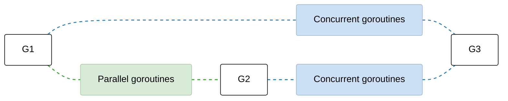

# Introduction to linear models - 

Linear models serves as the backbone for many *predictive* modeling techniques, offering an upfront approach to understanding relationships between variables. The recipe provides a foundation for understanding more complex linear techniques and their importance in predictive modeling.

```py
from sklearn.model_selection import train_test_split

# Linear regressin model of ordinary least squares methods
from sklearn.linear_model import LinearRegression

# Mathematical indicators used to evaluate the quality of a model
from sklearn.metrics import mean_squared_error, r2_score

feature_name = [f'feature_{i}' for i in range(100)]
# Split the data into training and testing sets
# train_test_split -- used to randomly divide the dataset into training set and test set
X_train, X_test, y_train, y_test = train_test_split(
    X, y, test_size=0.2, random_state=123
)

# Create and fit a linear regression model
linear_model = LinearRegression()
linear_model.fit(X_train, y_train)

# Make predictions on the test set
y_pred = linear_model.predict(X_test)

# Evaluate the performance using the MSE and R^2
mse = mean_squared_error(y_test, y_pred)
r2 = r2_score(y_test, y_pred)
print(f"Mean Squared Error: {mse: .2f}")
print(f"R-squared: {r2:.2f}")

# visualize the data regression line
plt.figure(figsize=(10, 6))
plt.scatter(X_test[:, 0], y_test, color="blue", alpha=0.5, label="Test Data")
plt.scatter(X_train[:, 0], y_train, color="green", alpha=0.5, label="Train Data")

# Sort the data for a smooth line plot
X_line = np.linspace(df["feature_0"].min(), df["feature_0"].max(), 100).reshape(-1, 1)
X_line_full = np.zeros((100, len(feature_name)))
X_line_full[:, 0] = X_line.ravel()

y_line = linear_model.predict(pd.DataFrame(
    X_line_full, columns=feature_name
))
plt.plot(X_line, y_line, color='red', label='Regression Line')
plt.xlabel('feature_0')
plt.ylabel('target')
plt.title('Linear Regression Fit')
plt.legend()
plt.show()
```

### Dataset setmentation

- `X`is the feature matrix, and `y`is the target variable.
- `test_size = 0.2`indicates that 20% of the data is extracted as a test set, and the remaining 80% is used to train the model.
- `random_state=123`-- Set a random seed. This ensures that every time U run this code, the data is the same, making it easy to reproduce the results and debug.

##### Model training and prediction

```py
# Create and fit a linear regression model
linear_model = LinearRegression()
linear_model.fit(X_train, y_train)

# Make predictions on the test set
y_pred = linear_model.predict(X_test)
```

- `LinearRegression()`-- creates an creates an empty linear regression model object.
- `fit(X_train, y_train)`-- Let the model learn from the training set data. It looks for a best-fit hyperplane in a 100-dimensinoal feature space and calculates the weight and bias term for each feature.
- Model prediction -- `.predict(X_test)`-- uses model U just trained to make predictions about new data that U have never seen before, and the predicted value is `y_pred`.

##### Model evaluation indicators

```py
# Evaluate the performance using the MSE and R^2
mse = mean_squared_error(y_test, y_pred)
r2 = r2_score(y_test, y_pred)
print(f"Mean Squared Error: {mse: .2f}")
print(f"R-squared: {r2:.2f}")
```

- Mean square error (MSE) -- Measures the mean sum of squares between the predicted and true values. The smaller the value, the better, the more accurate the prediction.
- `R-square`-- Measure how well the model interprets data variability. Values typically range from 0 to 1. The coloer to 1 the better the model fits.

How it works -- 

```py
X_line_full = np.zeros((100, len(feature_name)))
X_line_full[:, 0] = X_line.ravel()

# 绘制这根红色的回归线
plt.plot(X_line, y_line, color='red', label='Regression Line')
plt.xlabel('feature_0')  # X 轴标签
plt.ylabel('target')     # Y 轴标签
plt.title('Linear Regression Fit') # 图表标题
plt.legend()             # 显示图例 (Test Data, Train Data, Regression Line)
plt.show()               # 展示图表
```

Clever operation to generate regression lines -- 

```py
# Sort the data for a smooth line plot
X_line = np.linspace(df["feature_0"].min(), df["feature_0"].max(), 100).reshape(-1, 1)
```

`reval()`works by flattening a multidimensional array into a one-dimensional array.

- `X_line`is usually a two-dimensional array -- `(100, 1)`or `(1, 100)`
- `X_line.ravel()`will force it to converted to a one-dimensinal array.

If U write `X_line_full[:, 0] = X_Line`directly without `.ravel()`, you will often get an error or the behavior will not be as expected cuz the shape does not match cannot be assigned directly to `(100,)`.

#### Differnces from `flatten()`-- very important

| 操作        | 返回类型     | 是否复制数据 | 推荐场景           |
| ----------- | ------------ | ------------ | ------------------ |
| `ravel()`   | view（视图） | 通常不复制   | **推荐**，性能更好 |
| `flatten()` | copy（副本） | 总是复制     | 需要修改结果时使用 |

##### How it works -- 

Linear regression is fundamental technique used to model relationships between a dependent variable (target) and one or more indepentent variables -- The model assumes that there is a linear relaionship between these variables.
$$
y = \beta_0 + \beta_1 x_1 + \beta_2 x_2 + \cdots + \beta_n x_n + \epsilon
$$

## Being puzzled about when to use channels or mutexes

Given a concurrency problem, it may not always be clear whether in go concurrent programming -- when to use channels and when to use mutexes -- Many Go beginners, influenced by the famous saying *share memory through communication*.

##### Core philsophy -- Tool are complementary

Although Go officials advocate channels, they do not reject mutex locks.

- `Channels`-- Focuses on *communication* and *orchestration* -- They are like a pipeline that is responsbile for passing ownership or signals between concurrent units.
- Mutexes -- Focuses on the state of protection -- the act like a safe, ensuring that only one Goroutine can manipulate the data in at any one time.

Reviews the characteristrics of channels, which are the basis for understanding subsequent decisions -- 

- `Unbuffered`-- Must be delivered hand-to-hand - the sender and receiver must be ready at the same time, otherwise, it will block.
- `Buffered`-- Like a transit repository -- the sender blocks only when the warehouse is full, and the receiver blocks only when the warehouse is empty.



In generally, parallel gorotuines need to be synchronized -- fore, they must by sync when they need to access or modify the same shared resource. This sync is usually enforced through mutex and cannot rely on any type of channel - therefore, in general, sync between parallel goroutines should be done using mutex.

1. Parallel goroutines - use Mutexes -- 

   When goroutines are performing the same task in parallel and need to access or modify a shared resource.

   - Goal Synchronization
   - Mechanism -- Mutexes ensure exclusive access, preventing multiple goroutines from corrupting the state at the same time
   - Key concept -- Protecting a shared state.

2. Concurent Goroutine - Use Channles -- 

   When goroutines represent different stages of a logic flow and need to work together -- 

   - Goal -- Coordination and Orchetration
   - Mechanism -- Channels are used to signal that data is ready or to transfer the owership of a resource from one stage to the next
   - Key concept -- Communication and signaling.

| **Feature**         | **Mutexes**                                   | **Channels**                                     |
| ------------------- | --------------------------------------------- | ------------------------------------------------ |
| **Primary Use**     | **Synchronization**                           | **Coordination / Orchestration**                 |
| **Focus**           | Shared State                                  | Communication                                    |
| **Common Scenario** | Multiple workers updating one cache/variable. | Passing a processed object to the next function. |
| **Semantic**        | "Wait your turn to touch this."               | "Here is the data" or "I am done."               |

### Not understanding race problems

Race problems can be among the hardest and most insidious bugs a progrmmer can face. As Go developers, must understand crucial aspects such as data races and race conditions, their possible impacts, and how to avoid them. We will go through these topics by first discussing data races versus race conditions and then examining the Go memroy model and why it matters.

##### Data Races vs. race conditions

First focus on data races, A data race occurs when two or more goroutines simultneously access the same memory location and at least one is writing.

```go
i := 0
 
go func() {
    i++       
}()
 
go func() {
    i++
}()
```

Atomic opertions can be done in Go using the `sync/atomic`package -- Here is an example of how can increment atomically in `int64`-- 

```go
var i int64

go func() {
    atomic.AddInt64(&i, i)
}()

go func() {
    atomic.AddInt64(&i, 1)
}
```

Another option is to synchronize the two goroutine with an ad hoc data structure like a mutex. *Mutex* stands for *mutual exculsion* - a mutex ensures that at the most one goroutine accesses a so-called crtical section.

```go
i := 0
mutex := sync.Mutex{}

go func() {
    mutex.Lock()
    i++
    mutex.Unlock()
}()

go func(){
    mutex.Lock()
    i++
    mutex.Unlock()
}()

i := 0
mutex := sync.Mutex{}
 
go func() {
    mutex.Lock()
    defer mutex.Unlock()
    i = 1                 
}()
 
go func() {
    mutex.Lock()
    defer mutex.Unlock()
    i = 2                 
}()
```

### Creating Secure Activation Tokens

The integrity of our activation process hinges on one key thing - the unguessability of the token that we send to the user's address. If the token is easy to guess or can be *brute-forced*, then it would be possible for an attacker to activate a user's account even if they don't have access to the user's email inbox.

Because of this, we want the token to be generated by a *cryptographically secure random* number generator and have enough entropy that it is impossible to guess.

```go
const (
	ScopeActivation = "activation"
)

// Token define a token struct to hold the data for an individual token
type Token struct {
	Plaintext string
	Hash      []byte
	UserID    int64
	Expiry    time.Time
	Scope     string
}

func generateToken(userID int64, ttl time.Duration, scope string) (*Token, error) {
    // Create a token instance containing the user ID, expiry, and scope information.
    // Notice that we add provided ttl duration parameter to the curent time to get expiry time
	token := &Token{
		UserID: userID,
		Expiry: time.Now().Add(ttl),
		Scope:  scope,
	}

	// Initialize a zero-valued byte slice with a length of 16 bytes.
	randomBytes := make([]byte, 16)

    // use the `Read()` function from crypto/rand package to fill the byte slice with
    // random bytes from your OS
	_, err := rand.Read(randomBytes)
	if err != nil {
		return nil, err
	}

    // Encode the byte slice to a base-32-encoded string and assign it to the token
    // Plaintext filed. This will be the token string that we send t the user.
    //
    // Y3QMGX3PJ3WLRL2YRTQGQ6KRHU
    //
    // Note that by default base-32 strings may be padded at the end with the =
    // character. We don't need this padding character for the purpose of our tokens, so
    // we use the WithPadding(base32.NoPadding) method in the line below to omit them.
	token.Plaintext = base32.StdEncoding.WithPadding(base32.NoPadding).EncodeToString(randomBytes)

    // Generates a SHA-256 hash of the plaintext token string. This will be the value
    // that we store in the `hash` field of our database table. Note that the 
    // sha256.Sum256() function returns an *array* of length 32.
	hash := sha256.Sum256([]byte(token.Plaintext))
	token.Hash = hash[:]

	return token, nil
}
```

It's important to point out that the plaintext token strings we are creating here like `Y3QMGX3PJ3WLRL2YRTQGQ6KRHU `are not 16 characters long -- but rather they have an underlying entropy of 16 bytes of *randomness*. The length of the plaintext token string itself depends on *how those 16 random bytes are encoded to create a string*.

#### Creating the `TokenModel`and Validation Checks

Move on the set up a `TokenModel`type which encapsulates the dbs interactions with our PostgreSQL `tokens`table. We will follow a very similar pattern to the `MovieModel`and `UserModel`again.

- `Insert()`to insert a new token record in the dbs
- `New()`-- will be shortcut method which creates a new token using the `generateToken()`function and then calls `Insert()`to store the data.
- `DeleteAllForUsers()`to delete all tokens with a specific scope for a specific user.

```go
func (m TokenModel) Insert(token *Token) error {
	query := `
		INSERT INTO tokens (hash, user_id, expiry, scope)
		VALUES ($1, $2, $3, $4)`

	args := []any{token.Hash, token.UserID, token.Expiry, token.Scope}

	ctx, cancel := context.WithTimeout(context.Background(), 3*time.Second)
	defer cancel()

	_, err := m.DB.ExecContext(ctx, query, args...)
	return err
}

func (m TokenModel) Insert(token *Token) error {
	query := `
		INSERT INTO tokens (hash, user_id, expiry, scope)
		VALUES ($1, $2, $3, $4)`

	args := []any{token.Hash, token.UserID, token.Expiry, token.Scope}

	ctx, cancel := context.WithTimeout(context.Background(), 3*time.Second)
	defer cancel()

	_, err := m.DB.ExecContext(ctx, query, args...)
	return err
}

func (m TokenModel) DeleteAllForUser(scope string, userID int64) error {
	query := `
		DELETE FROM tokens
		WHERE scope = $1 AND user_id = $2`

	ctx, cancel := context.WithTimeout(context.Background(), 3*time.Second)
	defer cancel()

	_, err := m.DB.ExecContext(ctx, query, scope, userID)
	return err
}
```

##### The `math/rand`package -- 

Go also has a `math/rand`package which provides a *deterministic* pseudo-random number generator - It's important that U never use the `math/rand`package for any purpose where cryptographic security is required, such as generating tokens or secrets like we are here.

## Enhancing Components with Hooks

Rendering is the heartbeat of a React application. When sth changs, the component tree rerenders -- reflecting the least data as a user interface. `useState`has been our workhorse for describing how our components should be rendering. `useState, useRef`and `useContext`and saw that we compose these hooks into our own custom hooks -- `useInput`and `useColors`.

```tsx
export default function Checkbox() {
    const [checked, setChecked] = useState(false);
    alert(`checked ${checked.toString()}`);

    return (
        <>
            <input
                type="checkbox"
                value={checked}
                onChange={() => setChecked(checked => !checked)}
            />
            {checked ? "checked" : "not checked"}
        </>
    );
}
```

Scratch that, we can't call `alert`after the render cuz the code will never be reached - To ensure that we see the `alert`as expected.

```jsx
function App() {
    const [val, set]= useState("");
    const [phrase, setPhrase] = useState("example phrase");
    const createPhrase = ()=> {
        setPhrase(val);
        set('');
    };

    useEffect(() => {
        console.log(`typing ${val}`);
    });
    
    useEffect(()=> {
        console.log(`saved phrase ${phrase}`);
    });
    
    return (
        <>
            <label>Favorite phrase</label>
            <input value={val}
                   placeholder={phrase}
                   onChange={e=> set(e.target.value)} />
            <button onClick={createPhrase}>Save</button>
        </>
    )
}
```

Don't want every effect to be invoked on every render. Need to associate `useEffect`hooks with specific data changes. To sovle this problem, can incorporate the dependency array.

```jsx
useEffect(() => {
  console.log(`typing "${val}"`);
}, [val]);

useEffect(() => {
  console.log(`saved phrase: "${phrase}"`);
}, [phrase]);

useEffect(() => {
  console.log("either val or phrase has changed");
}, [val, phrase]);

useEffect(() => {
  console.log("only once after initial render");
}, []);

useEffect(() => {
  welcomeChime.play();
}, []);

useEffect(() => {
  welcomeChime.play();
  return () => goodbyeChime.play();
}, []);
```

This pattern is useful in many situations, Perhaps, we will subscribe to a news feed on first render. Then we will unsubscribe from the news feed with the cleanup function.

```jsx
const [posts, setPosts]= useState([]);
const addPost = post => setPosts(allPosts=> [post, ...allPosts]);

useEffect(()=> {
    newsFeed.subscribe(addPost);
    welcomeChime.play();
    return ()=> {
        newsFeed.unsubscribe(addPost);
        goodbyeChime.play();
    };
}, []);

useEffect(() => {
  newsFeed.subscribe(addPost);
  return () => newsFeed.unsubscribe(addPost);
}, []);

useEffect(() => {
  welcomeChime.play();
  return () => goodbyeChime.play();
}, []);
```

##### Implmenting error boundaries

Use `ErrorBoundary`from the `react-error-boundary`package. Use this in the blog post list and detail pages.

```tsx
export function ErrorAlert({
                               error, resetErrorBoundary
                           }: { error: Error, resetErrorBoundary: () => void }) {
    return (
        <div role="alert">
            <h3>Sth went wrong</h3>
            <p>{error?.message || String(error)}</p>
            <button onClick={resetErrorBoundary}>Retry</button>
        </div>
    )
}
```

Wrap the `ErrorBoundary`from `react-error-boundary`.

##### Handling errors with React error boundaries

In this section, will learn about the error handling using React error boundaries. With this - will improve the error handling in our apps.

A React server Function is exactly as the name suggests -- it's function that executes on the server. A common use case is to execute a dbs mutation.