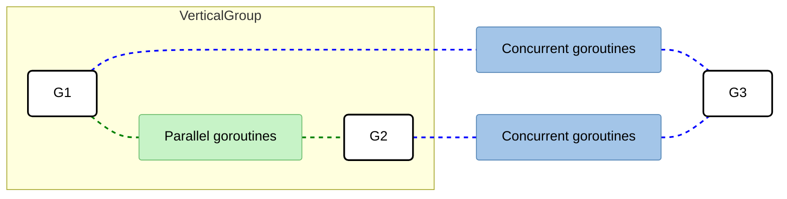

# Machine Learning Linear regression workflow

This code is vyer classic *machine learning linear regression workflow* -- Uses Python's `scikit-learn`library to train and evaluate the model, and visualizes the results with the ``matplotlib`library.

```py
from sklearn.model_selection import train_test_split
from sklearn.linear_model import LinearRegression
from sklearn.metrics import mean_squared_error, r2_score

feature_name = [f'feature_{i}' for i in range(100)]
# Split the data into training and testing sets
X_train, X_test, y_train, y_test = train_test_split(
    X, y, test_size=0.2, random_state=123
)

# Create and fit a linear regression model
linear_model = LinearRegression()
linear_model.fit(X_train, y_train)

# Make predictions on the test set
y_pred = linear_model.predict(X_test)

# Evaluate the performance using the MSE and R^2
mse = mean_squared_error(y_test, y_pred)
r2 = r2_score(y_test, y_pred)
print(f"Mean Squared Error: {mse: .2f}")
print(f"R-squared: {r2:.2f}")

# visualize the data regression line
plt.figure(figsize=(10, 6))
plt.scatter(X_test[:, 0], y_test, color="blue", alpha=0.5, label="Test Data")
plt.scatter(X_train[:, 0], y_train, color="green", alpha=0.5, label="Train Data")

# Sort the data for a smooth line plot
X_line = np.linspace(df["feature_0"].min(), df["feature_0"].max(), 100).reshape(-1, 1)
X_line_full = np.zeros((100, len(feature_name)))
X_line_full[:, 0] = X_line.ravel()

y_line = linear_model.predict(pd.DataFrame(
    X_line_full, columns=feature_name
))
plt.plot(X_line, y_line, color='red', label='Regression Line')
plt.xlabel('feature_0')
plt.ylabel('target')
plt.title('Linear Regression Fit')
plt.legend()
plt.show()
```

##### Visualization -- 

```py
# 绘制散点图
plt.figure(figsize=(10, 6))
plt.scatter(X_test[:, 0], y_test, color="blue", alpha=0.5, label="Test Data")
plt.scatter(X_train[:, 0], y_train, color="green", alpha=0.5, label="Train Data")
```

This part draws the data points on a two-dimensional plane.

```py
# 生成平滑的回归线
X_line = np.linspace(df["feature_0"].min(), df["feature_0"].max(), 100).reshape(-1, 1)
X_line_full = np.zeros((100, len(feature_name)))
X_line_full[:, 0] = X_line.ravel()

y_line = linear_model.predict(pd.DataFrame(
    X_line_full, columns=feature_name
))
plt.plot(X_line, y_line, color='red', label='Regression Line')
```

- **This is a clever trick for handling multi-dimensional feature drawing**: because the model is trained on multiple features (known by `len(feature_name)`), if you want to draw a regression line based on the first feature `feature_0`, you can't just enter one feature for the model to predict.
- The code first generates 100 evenly distributed `feature_0` data points (`X_line`) in `np.linspace`.
- Then create a matrix `X_line_full` with all 0s and cram those 100 points into the first column. This means that the effect of `feature_0` on the target value prediction is observed separately, **assuming that all other features are 0**.

#### Gain insights into the mathematics

Linear regression is a fundamental technique used to model the relationship between a dependent variable. In ML, Linear models and regularization usually appear in pairs - if linear models are the first intution tries to understand data, then *regularization* is the *rational boundary* that contraints this intiution and prevents it from going to extremes -- their core meaning can be understood from the following 3 dimensions.

1. Establish a basline -- When faced with complex tasks, linear models are often the first algorithm to run. What does it tell U - how much can U predict if U use only the simplest linear combinations.
2. Causal explanation -- the linear model gives each feature a weight `B`-- in areas such as tax.
3. Extremely efficient computation -- Linear regression has analytical solutions, is extremely fast to train on large-scale datasets.

## Being puzzled about when to use channels or mutexes

Given a concurrency problem, it may not always be clear whether we can implement a solution using channles or mutexes. Cuz go promotes sharing memory by communication. However, we should see the two options as comlementary. This secion clarifies when we should favor one option over the other.

Channels are a communication mechanism -- Internally, a channel is a pipe we can use to send and receive values and that allows us to conect concurrent goroutines.

- *Unbuffered* -- The sender goroutine blocks until the receiver goroutine is ready
- *Buffered* -- The sender goroutine blocks only when the buffer is full.



Get back to our initial problem. When should we use channels or mutexes -- will use example as a backbone.

- `G1`and `G2`are parallel goroutines. The may be two goroutines executing the same function that keeps receiveing messages from a channel, or perhaps two goroutines executing the same HTTP handler at the same time.
- On the other hand, `G1`and `G3`are concurrent gorouting, as are `G2`and `G3`. All the goroutines are part of an overall concurrent structure.

In general, parallel goroutines have no *synchronize* -- fore, when they need to access or mutate a shared resource such as a slice. Synchronization is enforced with mutexes but not with any channel types. Conversely, in general, concurrent goroutines have to coordinate and orchestrate. If `G3`needs to aggregate results from both `G1`and `G2`, `G1`and `G2`need to signal to `G3`that a new intermediate result is avaialble.

### Not Understanding race problems

Race problems can be among the hardest and most insidious bugs a progrmmer can face. As Go developers, we must understand crucial aspects such as data race and race conditions, their possible impacts, and how to avoid them.

```go
var i int64
go func()  {
    atomic.AddInt64(&i, 1)
}()
go func() {
    atomic.AddInt64(&i, 1)
}()
```

Another option is to sync the two goroutines with an ad hoc data structure like a mutex, Mutex stands for *mutal exclusion* -- a mutex ensures that at most one goroutine accesses a so-called critircal section --  Fore:

```go
i := 0
mutex := sync.Mutex{}

go func() {
    mutex.Lock()
    i++
    mutex.Unlock()
}()

go func() {
    mutex.Lock()
    i++
    mutex.Unlock()
}
```

Which approach works best -- the boundary is pretty straightforward. As we mentioned, the `sync/atomic`packge works only with specific types. Like:

```go
i := 0
ch := make(chan int)

go func() {
    ch <- 1
}()

go func() {
    ch <- 1
}()

i+= <-ch
i+= <-ch
```

Instead of having two goroutines increment a shared variable, now each one makes an assignment.

```go
i := 0
mutex := sync.Mutex{}

go func() {
    mutex.Lock()
    defer mutex.Unlock()
    i=1
}()

go func() {
    mutex.Lock()
    defer mutex.Unlock()
    i=2
}()
```

##### The Go memory model

The previous section discussed three main techniques to sync goroutines, atomic operations, mutexes, and channels. However, there are some core principles we should be aware of as Go developers -- FORE, buffered and unbuffered channels offer differ guarantees.

The Go memory model is a specification that defines the conditions under which a read from a variable in one goroutine can be guaranteed to happen after a write to the same variable in a different goroutine.

### User Activation

At the moment a user can register for an account with our *Greenlight API* -- but don't know for sure that the email address they provided during registration *acutally* belongs to *them*. To give U an overview upfront, the account activation process will work like this -- 

1. As part of the registration process for a new user we will create cryptographically-secure random *activation* token that is impossible to guess.
2. We will then store a hash of this activation token an new `tokens`table, alongside the new user's ID and an expiry time for the token.
3. We will send the original activation token to the user in their welcome email.
4. If the hash of the token exists in the tokens table and hasn't exired, then will update the `activated`status for the relevant user to `true`.
5. Lastly, we will delete the activation token from our `tokens`table so that it can't be used again.

In this section of the book, you will learn how to -- 

- Implement a secure's account activation's workflow which verifies a new user's email address.
- Generate cryptographically-secure random tokens using Go's `crypto/rand`and `encoding/base32`packages
- Generate fast hashes of data using the `crypto/sha256`package.
- Implement pattern for wroking with cross-table relationships in your dbs, including setting up FKs and retreiving  related data via SQL `JOIN`queries.

#### Setting up the Tokens Database Table

```sql
CREATE TABLE IF NOT EXISTS tokens (
    hash bytea PRIMARY KEY,
    user_id bigint NOT NULL REFERENCES users ON DELETE CASCADE,
    expiry timestamp(0) with time zone NOT NULL,
    scope text NOT NULL
);
```

- The `hash`column will contain a SHA-256 hash of the activation token - it's important to emphasize that we will only store a hash of the activation token in our dbs. Want to hash the token before storing it for the same reason that we bcrypt a user's password -- it provides an extra layer of protection if the dbs is ever compromised or leaked.
- The `user_id`column will contain the `ID`of the user associated with the token. Use the `DEFERENCES user`syntax to create a *foreign key constraint* -- against the primary key of our `users`table.
- The `expiry`column will contain the time that we consider a token to be *expired* and no longer valid.
- Lastly the `scope`column will denote what *purpose* the token can be used for. Later in the book we will also need to create and store *authentication tokens*, and most of the code and storage requirements for these is exactly the same as for our 

##### Creating Scrure Activation Tokens

The integrity of our activation process hinges on one key thing -- the *unguessability* of the token that we send to the user's email address. If the token is easy to guess or can be brute-forced, then it would possible for an attacker to activate a user's account even if they don't have access to user's email inbox.

```go
const (
	ScopeActivation = "activation"
)

// Token define a token struct to hold the data for an individual token
type Token struct {
	Plaintext string
	Hash      []byte
	UserID    int64
	Expiry    time.Time
	Scope     string
}

func generateToken(userID int64, ttl time.Duration, scope string) (*Token, error) {
	token := &Token{
		UserID: userID,
		Expiry: time.Now().Add(ttl),
		Scope:  scope,
	}

	// Initialize a zero-valued byte slice with a length of 16 bytes.
	randomBytes := make([]byte, 16)

	_, err := rand.Read(randomBytes)
	if err != nil {
		return nil, err
	}
	token.Plaintext = base32.StdEncoding.WithPadding(base32.NoPadding).EncodeToString(randomBytes)
	hash := sha256.Sum256([]byte(token.Plaintext))
	token.Hash = hash[:]

	return token, nil
}
```

It's important pont out that the plaintext token strings we are creating here like `Y3QMGX3PJ3WLRL2YRTQGQ6KRHU`are not 16 characters long -- but rather they have an underlying *entropy* 16 bytes of randomess.

The length of the plaintext token string itself depends on how *those* 16 random bytes are encoded to creating a *string* -- in our case we encode the random bytes to a base-32 string, which results in a string with 26 characters.

##### Creating the `TokenModel`and Validation checks

Let's move on and set up a `TokenModel`type which encapsulates the dbs interactions with our PostgreSQL `tokens`table. Follow a very similar pattern to the `MovieModel`and `UserModel`again, we will implement the following 3 methods on it.

- `Insert()`to insert a new token record in the dbs.
- `New()`will be a shortcut method which creates a new token using the `generateToken()`function and then calls `Insert()`to store the data.
- `DeleteAllForUser()`to delete all tokens with a specific scope for a specific user.

```go
func ValidateTokenPlaintext(v *validator.Validator, tokenPlaintext string) {
	v.Check(tokenPlaintext != "", "token", "must be provided")
	v.Check(len(tokenPlaintext) == 26, "token", "must be 26 bytes long")
}

func (m TokenModel) New(userID int64, ttl time.Duration, scope string) (*Token, error) {
	token, err := generateToken(userID, ttl, scope)
	if err != nil {
		return nil, err
	}
	err = m.Insert(token)
	return token, err
}

func (m TokenModel) Insert(token *Token) error {
	query := `
		INSERT INTO tokens (hash, user_id, expiry, scope)
		VALUES ($1, $2, $3, $4)`

	args := []any{token.Hash, token.UserID, token.Expiry, token.Scope}
	ctx, cancel := context.WithTimeout(context.Background(), 3*time.Second)
	defer cancel()
	_, err := m.DB.ExecContext(ctx, query, args...)
	return err
}

func (m TokenModel) DeleteAllForUser(scope string, userID int64) error {
	query := `
		DELETE FROM tokens
		WHERE scope = $1 AND user_id = $2`

	ctx, cancel := context.WithTimeout(context.Background(), 3*time.Second)
	defer cancel()
	_, err := m.DB.ExecContext(ctx, query, scope, userID)
	return err
}
```

#### The Dependency Array

`val`is a state variable that represents the value of the input field. the `val`changes every time the value of the input field changes. It's an array after all, it's possible to check multiple values in the dependency array -- let's say we wanted to run a specific effect any time either the `val`or `phrase`has changed -- 

```jsx
useEffect(()=> {
    console.log('either va or phrase has changed');
}, [val, phrase]);
```

If either of those values changes, the effect will be called again. It's also possible to supply an empty array as the second argument to a `useEffect`function -- An empty dependency array causes the effect to be invoked only once after the initial render -- 

```jsx
useEffect(()=>{
    console.log("only once after initial render");
}, []);

useEffect(()=> {
    welcomeChime.play();
    return ()=> goodbyChime.play();
}, []);
```

This pattern is useful in many situations, perhaps we wil subscribe to a news feed on first render. Unsubscribe from the news feed with the cleanup function. More specifically, start by creating a state value for *posts* and a function to change the value, called `setPosts`- then wil crete a function, `addPosts`, that will take in the newest post and add it to the array.

```jsx
const [posts, setPosts] = useState([]);
const addPost = post=> setPosts(allPosts=> [post, ...allPosts]);

useEffect(()=>{
    newsFeed.subscribe(addPost);
    welcomeChime.play();
    return()=> {
        newsFeed.unsubscrie(addPost);
        goodbyeChime.play();
    };
},[]);
```

This is a lot going on in `useEffect`though -- might want to use a separate `useEffect`for the news feed events and another `useEffect`for the chime events -- 

```jsx
useEffect(()=> {
    newsFeed.subscribe(addPost);
    return ()=> newsFeed.unsubscribe(addPost);
}, []);

useEffect(()=> {
    welcomeChime.play();
    return ()=> goodbyeChime.play();
}, []);
```

Splitting functionality into multiple `useEffect`calls is typically a good idea. But let's enhance this event further - what we're trying to create here is functionality for suscribing to a news feed that plays different jazzy sounds.

```go
const useJazzyNews = () => {
    const [posts, setPosts] = useState([]);
    const addPost = post=> setPosts(allPosts=>[post, ...allPosts]);
    
    useEffect(()=> {
        newsFeed.subscribe(addPost);
        return ()=> newsFeed.unsubscribe(addPost);
    }, []);
    
    useEffect(()=> {
        welcomeChime.play();
        return ()=> goodbyeChime.play();
    }, []);
    return posts;
}
```

Our custom hook contains all the functionality to handle a jazzay news feed -- which means that we can easily share this functionality with our components.


