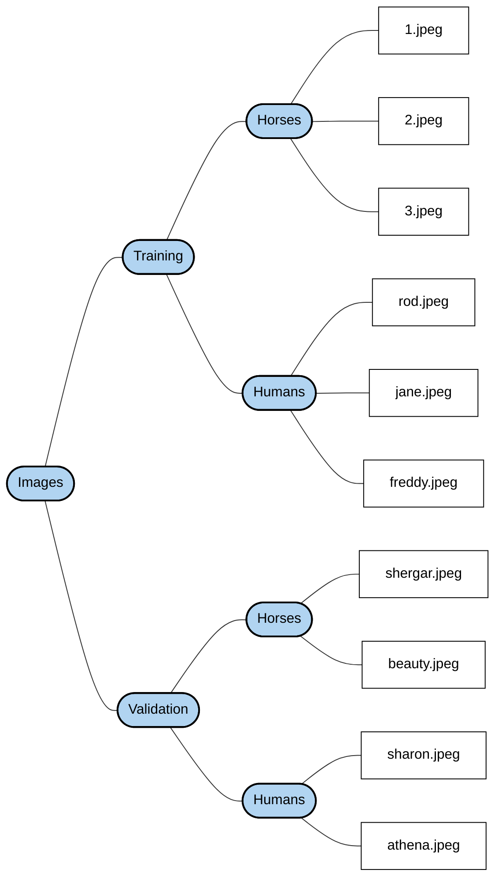

# Maxmizing class separability with LDA

LDA is a powerful dimensionality reduction technique that is particularly useful for supervised learning tasks, especially in classification problems - Unlike PCA, which focuses on maximizing variance across all data points without considering class labels, LDA aims to maximizing class *separability*.

*Linear Discriminant Analysis* -- LDA to achieve maximum category separation -- This is a very classic dimensionality reduction technique in machine learning classification tasks.

- PCA -- Unsupervised - Like a photographer looking for widest and most dispersed angles of objects to take pictures -- retain as much *fluctuating info* as posssible.
- LDA -- Supervised -- Just like a classification expert -- only looks at distribution of data -- but also stares at category labels. its goal is to find a projection direction --
  - Within-class Scatter is the smallest -- Data points of the same class are crowded together as much as possible.
  - Between-class scatter maximum -- the distance between the center points of different classes is as far as possible.

```python
from sklearn.discriminant_analysis import LinearDiscriminantAnalysis

X_wine, y_wine = wine.data, wine.target

# create an LDA pipeline for the wine dataset
lda_pipeline_wine = Pipeline([
    ('scaler', StandardScaler()),
    # means that we want to reduce the original 13D data to 2D to make it easier 
    # to draw 2D scatter plot
    ('lda', LinearDiscriminantAnalysis(n_components=2))
])

# Fit and transform the wine data
# Note that here the features `X_wine` and tags `y_wine` are introduced
# needs to know the category labels of the data, and the purpose is to find a projection
# decision so that similar data can be clustered.
X_lda_wine = lda_pipeline_wine.fit_transform(X_wine, y_wine)

plt.figure(figsize=(10, 8))
shapes = [*"o^D"]
colors = [*"rgb"]

for i, (shape, color) in enumerate(zip(shapes, colors)):
    mask = y_wine == i
    plt.scatter(
        X_lda_wine[mask, 0],
        X_lda_wine[mask, 1],
        c=color,
        marker=shape,
        edgecolor="black",
        label=wine.target_names[i],
    )

plt.xlabel('First LDA Component')
plt.ylabel('Second LDA Component')
plt.title('Wine Dataset - LDA Components')
plt.legend()
plt.show()
```

- Use `plt.scatter()`to draw a scatter plot, the first type draws a red circle, the second class draws a green triangle, and the 3rd class draws a blue diamond.
- Finally, add axis labels, titles, and legends, and display images.

LDA is a supervised technique that seeks find a linear combination of features that best separates two or more classes - the primary goals of LDA are as follows -- 

To expand on the final point, visualizations of the projected data (typically 2D scatter plots) from PCA and LDA can appear quite similar in certain datasets, but they often differ from in how well they separate classes.

##### Why They can Look Simiar

- In datasets where the directions of maximum variance align closely with the directions the best separae classes, which LDA priorizes - the projections overlap significantly.
- A classic example is the Iris dataset.

Look different -- 

- LDA typically produces *better class separation* because it explicitly optimizes for maximizing between-class variance while minimizing within-class variance.
- In cases where high-variance directions include a lot of within-class noise, PCA’s projection may show more overlap between classes, while LDA creates tighter, more separeted clusters.
- For multiclass problems, LDA is limited to at most dimensions whereas PCA can go higher but is often visualized in 2D anyway.

For multiclass problems - LDA is limited to at most -1 dimensions whereas PCA can go higher but is often visualized in 2D anyway. LDA generally provides superior discriminative power in classification scenarios.

When visualized, both PCA and LDA can be similar in appearance, depending on the dataset they are applied to - 

```python
pca_pipeline = Pipeline([
    ('scalar', StandardScaler()),
    ('pca', PCA(n_components=2))
])
X_pca = pca_pipeline.fit_transform(df_wine)

plt.figure(figsize=(14, 6))

plt.subplot(121) # column 1 row 2 activate first sub plot
shapes = [*"o^D"]
colors = [*"rgb"]
for i, (shape, color) in enumerate(zip(shapes, colors)):
    mask = y_wine == i
    plt.scatter(
        X_pca[mask, 0],
        X_pca[mask, 1],
        c=color,
        marker=shape,
        edgecolor="black",
        label=wine.target_names[i],
    )

plt.xlabel("First Principal Component")
plt.ylabel("Second Principal Component")
plt.title("Wine Dataset - PCA Components")
plt.legend()
plt.subplot(122)

for i, (shape, color) in enumerate(zip(shapes, colors)):
    mask = y_wine == i
    plt.scatter(
        X_lda_wine[mask, 0],
        X_lda_wine[mask, 1],
        c=color,
        marker=shape,
        edgecolor="black",
        label=wine.target_names[i],
    )
    
plt.xlabel('First LDA Component')
plt.ylabel('Second LDA Component')
plt.title('Wine Dataset - LDA Components')
plt.legend()
plt.tight_layout()
plt.show()
```

If using `plt.subplot(120)`then error. 

### Confusion Matrices

Then general idea of confustion matrix is to count the number of times instances of class A are classified as Class B.

| Actual \ Predicted | Not‑5      | 5         |
| ------------------ | ---------- | --------- |
| **Not‑5**          | 53892 (TN) | 687 (FP)  |
| **5**              | 1891 (FN)  | 3530 (TP) |

- 53892 -> correcty predicted as not-5 
- 687 -> incorrectly predicted as 5 FP Type I error

Second row actual 5

- 1891 -- incorrectly predicted as not 5 -- FN, Type II error
- 3530 -- Correctly predicted as 5 *true positives*.

##### Recall -- `TP / (TP+FN)` -- 

Recall rate measures how much U successfully find out of all the true positive samples -- Did I miss any of samples that were true and positive. $$
$$
Recall = \frac{3530}{3530 + 1891} \approx 0.651
$$
It is often convenient to combine precision and recall into a single metric called the `F1`score, especially when U need a single metric to compare two classifier The F1 score is the harmnoic mean of precision and recall. Whereas the regular mean treats all valus equally, the harmonic man gives much more weight to low values.

```python
X_train, X_test, y_train, y_test = X[:60000], X[60000:], y[:60000], y[60000:]

y_train_5 = (y_train == '5')  # True for all 5s, False for all other digits
y_test_5 = (y_test == '5')

from sklearn.linear_model import SGDClassifier

sgd_clf = SGDClassifier(random_state=42)
sgd_clf.fit(X_train, y_train_5)
sgd_clf.predict([some_digit])

from sklearn.model_selection import cross_val_score
cross_val_score(sgd_clf, X_train, y_train_5, cv=3, scoring="accuracy")
```

Scikit-learn does not let U set the threhold directly, but it does give you access to the decisions scores that it uses to make predictions -- instead of calling the classifier’s `predict()`method, can call its `decision_function()`-- which returns a score for each instance.

```python
from sklearn.metrics import f1_score
f1_score(y_train_5, y_train_pred)
```

Scikit-Learn does not let U set the threshold directly, but it does give U access to the decision scores that it uses to make predictions.

##### Use decision scores to control thresholds

Scikit-lean does not directly set classification thresholds, but it allows U to access the decision function scores that the model uses for classification.

```python
y_scores = sgd_clf.decision_function([some_digit])
y_scores
threshold = 0
y_some_digit_pred = (y_scores > threshold)
# array([ True ])
```

What is `decision_function()`-- Fore, `SGDClassifier, LinearSVC, LogisticRegression`-- `decision_function()`it is used to return the model’s raw decision score for each sample.

- The degree to which the mdoel considers this sample to be like a positive class is 2164
- The higher the score -- the more like the positive class
- The smaller fraction or even negative the more negative it is.

Cuz -- The higher the threhold, the harder it is for the model to predict as positive And -- 

- Positive samples are more likely to be missed
- So the recall rate drops.

```python
threshold = 3000
y_pred = (y_scores > threshold)
# False Cuz 2164<3000, so false of the score 2164<3000
```

```python
y_scores = cross_val_predict(sgd_clf, X_train, y_train_5, cv=3,
                             method="decision_function")
```

- Meaning - it returns the confidence score calculated by the model for each sample.
- Logic - the higher the score, the more the model feels is a *5* -- by default, the `score>0`prediction is positive and the `score<=0`prediction is negative.

```python
from sklearn.metrics import precision_recall_curve
precisions, recalls, thresholds = precision_recall_curve(y_train_5, y_scores)
```

When U throw the real label `y_train_5`and the calculated score `y_scores`to this function -- does the following --

- Automatically try hundreds or thousands of different threholds
- For each threhold, the corresponding *Precision* and *Recall* are calculated
- Returns 3 arrays, `precisions, recalls`and `thresholds`.

And, suppose U decide to aim for 90% precision, could use the first plot to find the threshold U need to use, but that is not very precise - alternatively, can search for the lowest the threhold that gives U at least 90% precision.

```python
idx_for_90_precision = (precisions >= 0.90).argmax()
threshold_for_90_precision = thresholds[idx_for_90_precision]
threshold_for_90_precision

y_train_pred_90 = (y_scores >= threshold_for_90_precision)
precision_score(y_train_5, y_train_pred_90)

recall_at_90_precision = recall_score(y_train_5, y_train_pred_90)
recall_at_90_precision
```

I want the model to be *as accurate* as possible when predicting positive classes, but at the cost of missing more positive samples - this code the process that implements it.

| Threshold      | Accuracy       | Recall rate     | Explained                                                  |
| -------------- | -------------- | --------------- | ---------------------------------------------------------- |
| Low threshold  | High call rate | Low accuracy    | There are many catches, but there are many false positives |
| High threshold | High accuracy  | Low recall rate | Catch it accurately, but miss a lot                        |

#### ROC (Receiver Operting Characteristic Curve)

ROC curves are very common evaluation tool in binary models -- it is similar to the *Precision/Recall* curve but focuses on different indicators -- 

- PR curve *Precision vs Recall*
- ROC curve -- TPR vs FPR

| Data situation                                         | Recommendation curve | Cause                              |
| ------------------------------------------------------ | -------------------- | ---------------------------------- |
| **Category balance**                                   | ROC                  | 稳定、信息充分                     |
| **Extremely unbalanced categories (e.g., 5 vs non-5)** | PR                   | 会被大量 TN 稀释，ROC 可能过于乐观 |

```python
from sklearn.metrics import roc_curve
fpr, tpr, thresholds = roc_curve(y_train_5, y_scores)
```

- `fpr`-- The false positive rate corresponding to each threshold
- `tpr`-- True rate recall for each threshold
- `thresholds`-- The corresponding threhold

ROC AUC means that when the model randomly selects a positive sample and a negative sample, the positive sample and a negative sample, the positive samples has a higher predictive score.

- AUC = 1 -> Model perfectly distinguishes between positive and negative samples
- AUC = 0.5 -> the model is the same as random guessing.
- AUC < 0.5 -> Reverse prediction of the model (positive class as negatie class, negative class as positive class).

```python
from sklearn.ensemble import RandomForestClassifier
forest_clf = RandomForestClassifier(random_state=42)

y_probas_forest = cross_val_predict(forest_clf, X_train, y_train_5, cv=3,
                                    method="predict_proba")
y_probas_forest[:2]
```

The model predicts that the first image is positive with 89% proability, and it predicts that the second image is negatvie with 99% probability.

## Adding the API handler and route

Next up, create a new `listMovieHandler`for our `GET /v1/movies`endpoint. For now, this handler will simply parse the request query string using the helpers we just made -- 

```go
func (app *application) listMoviesHandler(w http.ResponseWriter, r *http.request) {
    // To keep things consistent with our handlers -- 
    var input struct {
        Title string
        Genres []string
        Page int
        PageSize int
        Sort string
    }
    
    // Initialize a new Validator instance.
    v := validator.New()
    
    // calls r.URL.Query() to get the url.Values map continaing the query string data
    qs := r.URL.Query()
    
    // Use our helpers to extract the title and generates query string valus, falling back
    // to defaults of an empty string and an empty respectively if they are not provided by
    // the client
    input.Title = app.readString(qs, "title", "")
    input.Genres = app.readCSV(qs, "genres", []string{})
    
    input.Page = app.readInt(qs, "page", 1, v)
    input.PateSize = app.readInt(qs, "page_size", 20, v)
}
```

### Creating a filters struct

The `page, page_size`and `sort`query string parameters are things that you will potentially want to use on other endpongs in your API too - like: 

```go
type Filters struct {
    Page int
    PageSize int
    Sort string
}

// cmd/api/movies.go
func (app *application) listMoviesHandler(w http.ResponseWiter, r *http.Request) {
    var input struct {
        Title string
        Genres []string
        data.Filters
    }
    
    v := validator.New()
    qs := r.URL.Query()
    
    input.Title = app.readString(qs, "title", "")
    intput.Genres = app.readCSV(qs, "genres", []string{})
    
    // read the page and page_size query string values into the embedded struct.
    input.Filters.Page = app.readInt(qs, "page", 1, v)
    input.Filters.PageSize = app.readInt(qs, "page_size", 20, v)
    
    // Read the sort query string value into the embedded struct
    input.Filters.Sort = app.readString(qs, "sort", "id")
    if !v.Valid() {
        app.failedValidationResponse(w, r, v.Erros)
        return
    }
    fmt.Fprintf(w, "%+v\n", input)
}
```

#### Validating Query string Parametrs

Our API should already be returning valiation errors if the `page`and `page_size`query string parameters don’t contain integer values.

```sh
curl "localhost:4000/v1/movies?page=abc&page_size=abc"
```

```json
{
    "error": {
        "page": "must be an integer value",
        "page_size": "must be an integer value"
    }
}
```

For this still need to perform some additional sanity checks on the query string values - Specifically -- allow only `“id”, "title", "year".. "-id"`or `“-runtime”`. To fix this, open up the `internal/data/filters.go`file and create a new `ValidateFilters()`function which conducts these checks on the values.

```go
type Filters struct {
	// ...
	SortSafeList []string
}

func ValidateFilters(v *validator.Validator, f Filters) {
	v.Check(f.Page > 0, "page", "must be greater than zero")
	v.Check(f.Page <= 10_000_000, "page", "must be a maximum of 10 million")
	v.Check(f.PageSize > 0, "page_size", "must be greater than zero")
	v.Check(f.PageSize <= 100, "page_size", "must be a maximum of 100")
	v.Check(validator.PermittedValue(f.Sort, f.SortSafeList...), "sort", "invalid sort value")
}
```

Then we need to update our `listMoviesHandler`to set the supported values in the `SortSafelist`field, and subsequently call this new `ValidateFilters()`function -- 

```go
func (app *application) listMovieHandler(w http.ResponseWriter, r *http.Request) {
    var input struct {
        Title string
        Genres []string
        data.Filters
    }
    
    v := validator.New()
    qs := r.URL.Query()
    // ...
    input.Filtes.Sort = app.readString(qs, "sort", "id")
    input.Filters.SortSafelist = []string
    	{"id", "title", "year", "runtime", "-id", "-title", "-year", "-runtime"}
    
    // Execute the validation checks on the Filters struct and send a response
    // containing the errors if necessary -- 
    if data.ValidateFilter(v, input.Filters); !v.Valid() {
        app.failedValidationResponse(w, r, v.Errors)
        return
    }
    fmt.Fprintf(w, "%+v\n", input)
}
```

#### Listing data

Aim in this will be get the endpoint to return a JSON response containing an array of all movies -- similar to this - To retreive this data from our PSQL dbs, create a `GetAll()`method on our dbs model which executes the SQL -- 

```go
func(m MovieModel) GetAll(title string, genres []string, filters Filters) ([]*Movie, error) {
    query := `
        SELECT id, created_at, title, year, runtime, genres, version
        FROM movies
        ORDER BY id`
    // create a context with 3-second timeout
    ctx, cancel := context.WithTimeout(context.Background(), 3*time.Second)
    defer cancel()
    
    // Use QueryContext() to execute the query.
    rows, err := m.DB.QueryContext(ctx, query)
    if err != nil {
        return nil, err
    }
    
    defer rows.Close()
    
    movies := []*Movie{}
    
    for rows.Next() {
        // Initialize an empty Movie struct to hold the data for an individual movie
        var movie Movie
        
        // Scan the values from the row into the Movie struct
        err := rows.Scan (
        	&movie.ID,
            //...
            pa.Array(&movie.Genres),
            &movie.Version,
        )
        if err != nil {
            return nil, err
        }
        // add the movie struct to the slice.
        movies = append(movies, &movie)
    }
    
    if err = rows.Err(); err != nil {
        return nil, err
    }
    
    // if everything went ok - then return the slice of movies
    return movies, nil
}

func (app *application) listMoviesHandler(w http.ResponseHandler, r *http.Request) {
    var input struct {
        Title string
        Genres []string
        data.Filters
    }
    //...
    // Call the GetAll() method to retreive the movies passing in the various filter parameters
    movies, err := app.models.Movies.GetAll(input.Title, input.Genres, input.Filters)
    if err != nil {
        app.serverErrorResponse(w, r, err)
        return
    }
    
    // send a JSON response contianing the movie data
    err = app.writeJSON(w, http.StatusOK, enevlope{"movies", movies}, nil)
    if err != nil {
        app.serverErrorResponse(w, r, err)
    }
}
```

## Creating multi-page App with `next.js`-- 

- Creating routes
- Creating navigation
- Creating shared layout
- Creating dynamic routes
- Using search parmeters

```tsx
export default function Home() {
    return (
        <main>
            <h2>
                Welcome to my blog!
            </h2>
        </main>
    )
}
```

##### Understanding routes

```tsx
export default function Posts() {
    return (
        <main>
            <h2>Posts</h2>
            <ul></ul>
        </main>
    )
}
```

Will add some blog post data display on this page -- start by creating a `data`folder in the `src`folder with a file called `posts.ts`in the just like:

```tsx
export const posts = [
  {
    id: 1,
    title: 'Understanding React Hooks',
    description:
    'A comprehensive guide to React Hooks and how they simplify state management in functional components',
  },
	//...
];
```

Will now use the `posts`variable in the `Posts`page to output a list of blog posts -- open `app/posts/index.tsx`and add the following highlighted liines - 

```tsx
export default function Posts() {
    return (
        <main>
            <h2>Posts</h2>
            <ul>
                {posts.map((post) => (
                    <li key={post.id}>
                        <span>{post.title}</span>
                        <p>{post.description}</p>
                    </li>
                ))}
            </ul>
        </main>
    )
}
```

#### Creating navigation -- 

Next.js has two ways to implement navigation, which we will cover in this section -- as part of the learning process, will update the blog posts list to include links to associated `Post`page.

```tsx
export default function Posts() {
    return (
        <main>
            <h2>Posts</h2>
            <ul>
                {posts.map((post) => (
                    <li key={post.id}>
                        <Link href={`/posts/${post.id}`}>
                            {post.title}
                        </Link>
                        <p>{post.description}</p>
                    </li>
                ))}
            </ul>
        </main>
    )
}
```

The route we have use referenced doesn’t exist yet, let’s create it. Inside the `posts`folder.

##### Using `useRouter`-- 

The `useRouter`hook allows programmatic navigation, Unlike `Link`, can’t be used in an RSC, so the consuming component must be a client component -- the hook returns an object containing useful routing function as:

- `push`-- Performs Client-side navigation, adding a new entry to the browser history
- `replace`-- Performs client-side navigation, without adding a new entry to the browser history
- `refresh`-- Refreshes the current route without losing any state.

```tsx
function SomeComponent() {
    const router = useRouter();
    
    function handleClick() {
        if (someCheck()) {
            router.push('/some-path');
        }else 
            router.push('/some-other-path')
    }
    return <button onClick={handleClick}>Action</button>
}
```

The `useRouter`can’t be used in an RSC, so the consuming componetn must be a client component.

- The `useRouter`hook is called at the start of the component and assigned to a `router`variable, so all the routing functions are available in the `router`variable.
- The `router`push func is called in the button-click handler with the path being passed.

#### Creating Shared layout -- 

In this section, will create a header for our app containing links to the `Home`and `Posts`page, will use the shared layout capabilities of `Next.js`to implement this.

```tsx
export default function RootLayout({ children }: ...) {
    return (
        <html lang=”en”>
            <body ... >
            	{children}
            </body>
        </html>
    );
}
```

##### Creating a header

Will create a `Header`component in our app containing links to the `Home`and `Posts`pages, will then add `Header`to `RootLayout`to visible in all routers.

```tsx
import Link from ‘next/link’;

    export function Header() {
    return (
        <header>
            <Link href=”/”>Home</Link>
            <Link href=”/posts”>Posts</Link>
        </header>
    );
}

export default function RootLayout( ... ) {
    return (
        <html ... >
            <body ... >
                <Header />
                {children}
            </body>
        </html>
    );
}
```

### Building a CNN to Distinguish Between Horses and Humans

The Fashion MNIST dataset that you have been using up to this point comes with labels --- and every image file has an associated file with the label details - Many image-based datasets do not have this, and Horses or Humans is no exception -- 

```python
import urllib.request
import zipfile

url = "https://storage.googleapis.com/learning-datasets/horse-or-human.zip"
file_name = "horse-or-human.zip"
training_dir = 'horse-or-human/training/'
urllib.request.urlretrieve(url, file_name)

zip_ref = zipfile.ZipFile(file_name, 'r')
zip_ref.extractall(training_dir)
zip_ref.close()

url = "https://storage.googleapis.com/learning-datasets/validation-horse-or-human.zip"
file_name = "validation-horse-or-human.zip"
validation_dir = 'horse-or-human/validation/'
urllib.request.urlretrieve(url, file_name)

zip_ref = zipfile.ZipFile(file_name, 'r')
zip_ref.extractall(validation_dir)
zip_ref.close()
```

Simply need to ensure that your directory structure has a set of named subdirectories -- with each subdirectory being a label. just like -- 



To use the `DataLoader`-- simply use the following code just like - 

```python
from torchvision import datasets, transforms
from torch.utils.data import DataLoader

# Define transformations
train_transform = transforms.Compose([
    transforms.Resize((150,150)),
    
    # Flip the picture horizontally
    # Enhance the robustness of the model to changes in the left and right directions.
    # particularly effective for symmetrical objects such as humans/animals.
    transforms.RandomHorizontalFlip(),
    
    # Rotate the picture randomly with arange of ±20°
    transforms.RandomRotation(20),
    
    # This is a more powerful random affine transform that contains 
    transforms.RandomAffine(
        degrees=0,  # No rotation
        translate=(0.2, 0.2),  # Translate up to 20% vertically and horizontally
        scale=(0.8, 1.2),  # Zoom in or out by 20%
        shear=20,  # Shear by up to 20 degrees
    ),
    # [0, 255] changs [0, 1]
    transforms.ToTensor(),
    
    # Mapping pixels from [-1, 1] helps speed up training
    transforms.Normalize(mean=[0.5, 0.5, 0.5], std=[0.5, 0.5, 0.5]),

])

# Load the datasets
train_dataset = datasets.ImageFolder(root=training_dir, transform=train_transform)
val_dataset = datasets.ImageFolder(root=validation_dir, transform=train_transform)

# Data loaders
# shuffle=True -- to vaoid the model remembering the order
train_loader = DataLoader(train_dataset, batch_size=32, shuffle=True)
val_loader = DataLoader(val_dataset, batch_size=32, shuffle=True)
```

This core goal of this code -- 

- Data augmentation on training images
- Unified image size, conversion to Tensor, normalization
- Load training set and validation set
- Packaged into iterable batches with `DataLoader`.

##### CNN architecture for *Horses* or *humans* -- 

There are several major differences between this data set and Fashin MNIST one, and U have to take them into account when designing an architecture for classifying the images -- first, the images are much larger -- 150 x 150 pxiels -- so more layers may be needed. Second -- the images are in full color -- not grayscale, so each image will have 3 channels instead of one. Third, there are only two image types, so we can actually classify them with only *one* output neuron, to do so, drive the value of that neuron.
