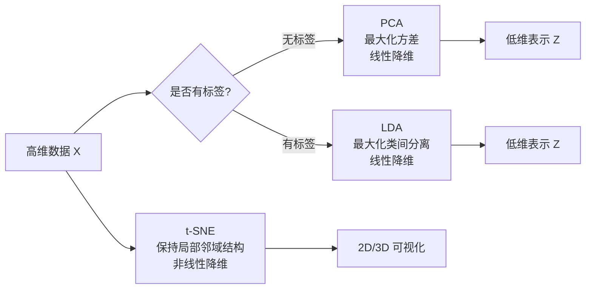
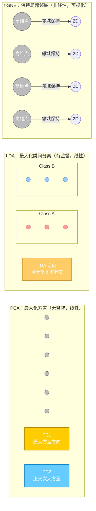

# PCA, LDA and t-SNE



#### PCA -- Principal Component Analysis

- Find the direction of the lagest variance in the data
- No labeling at all unsupervised.
- It is a linear dimensionality reduction method

##### Geometry is intutive -- 

1. Find a direction in the high-demensinoal space so that the projected data distribution is the most scattered
2. This direction is the first principal component
3. The second principal component is orthogonal to the first principal component, captureing remaining maxmimum variance

Applicable scenarios -- 

- Data Compression
- Noise removal
- Visualization
- Feature engineering

#### LDA -- Linear Discriminant Analysis

Core idea -- 

- Use tags
- Find the direction that maximizes the distance between classes and minimizes the distance within classes
- It is also a linear dimonsionality reduction

Geometry is intuitive -- 

- Imagine projecting different categories of dots onto a line
- LDA chooses a direction to keep the projections of different categories as separate as possible.

Applicable scenairos -- 

- Dimensionality reduction before classification
- Category separation visualizaiton
- LDA can only get up to C-1 dimension.

#### `t-SNE`- t-Distributed Stochastic Neighbor Embedding

Core idea -- 

- Maintain local neighborhood structure
- NonLinear dimensionality reduction
- Mainly used for visualization 2D/3D

Geometry is intutive -- 

- In high-dimensional space `t-SNE`keeps neighbors neighbors
- Far points are pushed further away
- The final layout is obtained by optimizing the KL divergence

Applicable scenarios -- 

- High-dimensional data visualization (MNIST, word vector, image embedding)
- Show the clustering structure
- Expore data distribution.

| method    | Whether to use labels | Linear/nonlinear | Goal                                  | Output dimensions | Typical uses:                                  |
| --------- | --------------------- | ---------------- | ------------------------------------- | ----------------- | ---------------------------------------------- |
| **PCA**   | None                  | Linear           | Maximize variance                     | Any               | Compression, preprocessing, visualization      |
| **LDA**   | ✔️                     | Linear           | Maximize interclass separation        | ≤ C−1             | Dimensionality reduction before classification |
| **t‑SNE** | None                  | Non-linear       | Maintain local neighborhood structure | Usually 2D/3D     | Visualize and explore structure                |

##### The REL betwen the 3 is summarized in one sentence

- PCA -- find the direction that best explains data changes
- LDA - Find the direction that best distinguishes the category
- t-SNE -- Find the 2D/3D layout that best shows the local structure



### Error Analysis

In this were a real project, would now follow the steps in your machine learning project checklist -- you’d explore data prepaation options. Try out multiple models, shortlist the best ones, fine-tune their typerparameters, using `GridSearchCV`-- and automates as much as possible. We will assume that U have found a promising model and U want to find ways to improve it.

##### Analyzing model errors and drawing confusion matrices -- 

If this is a real machine learning project, should now follow your ML project checklist -- explore data preparation options, try out multiple models -- filter out the best-performing models, find-tune hyperparameters wht `GridSearchCV`-- and automate as much as possible.

To do this, need to first generate a prediction using `cross_val_predict()`-- Then pass the true and predictive tags to `confusion_matrix()`just like did before.

```py
some_digit_scores = svm_clf.decision_function([some_digit])
some_digit_scores.round(2)

class_id = some_digit_scores.argmax()
class_id
svm_clf.classes_
svm_clf.classes_[class_id]
```

##### Use a color confusion matrix  to make the results easier to analyze -- 

Can use `ConfustionMatrixDisplay.from_predictions()`plot -- like:

```py
from sklearn.metrics import ConfusionMatrixDisplay

y_train_pred = cross_val_predict(sgd_clf, X_train_scaled, y_train, cv=3)
ConfusionMatrixDisplay.from_predictions(y_train, y_train_pred)
plt.show()
```

This produces the left diagram - this confusion matrix looks pretty good -- most images are on the main diagnol, which means that they were classified correctly -- Notice that the cell on the siagnoal 

```py
from sklearn.metrics import ConfusionMatrixDisplay

y_train_pred = cross_val_predict(sgd_clf, X_train_scaled, y_train, cv=3)
plt.rc('font', size=9)  # extra code – make the text smaller
ConfusionMatrixDisplay.from_predictions(y_train, y_train_pred)
plt.show()
```

This produces the left diagram -- this confusion matrix looks pretty god -- most images are on the main diagonal - which means that they were classified correctly.

Core acceleration -- enable multi-core parallelism -- `n_jobs=-1`-- this is the most effective means, by default, it uses only one CPU core, by setting `n_jobs=-1`, the system will start 3 processes at the time to precess 3 folds each, can theoetically increase the speed by nearly 3 times.

### Sort Lists -- 

Let’s now update the logic logic our `GET /v1/movies`endpoint so that the client can control how the movies are sorted in the JSON response -- As briefly explained earlier -- want to left client control the sort order via a query string parameter in the formt `sort={-}{field_name}`, where the optional - character is used to indicate a descending sort order --fore -- 

```sql
SELECT id, created_at, title, year, runtime, genres, version
FROM movies
WHERE (STRPOS(LOWER(title), LOWER($1)) > 0 OR $1 = '')
AND (genres @> $2 OR $2 = '{}')
ORDER BY year DESC, id ASC
```

##### Implementing sorting

To get the dynamic sorting working, let’s bring by updating our `Filters`struct to include some `sortColumn()`and `sortDirection()`helpers transform a query string value into values can use in SQL query.

```go
type Filters struct {
	Page         int
	PageSize     int
	Sort         string
	SortSafeList []string
}

func (f Filters) sortColumn() string {
	for _, safeValue := range f.SortSafeList {
		if f.Sort == safeValue {
			return strings.TrimPrefix(f.Sort, "-")
		}
	}
	panic("unsafe sort parameter " + f.Sort)
}

func (f Filters) sortDirection() string {
	if strings.HasPrefix(f.Sort, "-") {
		return "DESC"
	}
	return "ASC"
}
```

Notice that the `sortColumn()`function is constructed in such a way that it will panic if the client-provided `Sort`value doesn’t match one of the entries in our safelist. In theory this shouldn’t happen - the `Sort`value should have already been checked by calling the `ValiationFilters()`function.

```go
func (m MovieModel) GetAll(title string, genres []string, filters Filters) ([]*Movie, Metadata, error) {
	// Create a context with 3s timeout.
	ctx, cancel := context.WithTimeout(context.Background(), 3*time.Second)
	defer cancel()

	query := fmt.Sprintf(`
		SELECT count(*) OVER(), id, created_at, title, year, runtime, genres, version
		FROM movies
		WHERE (to_tsvector('simple', title) @@ plainto_tsquery('simple', $1) OR $1='')
		AND (genres @> $2 OR $2='{}')
		ORDER BY %s %s, id ASC`
    //..
}
```

#### Paginating Lists

if U have an endpoint which returns a list with hundreds of thousands of records, then for performance or usuablity reasons U might want to implement some form of patination on the endpoing - so that it only returns a subset of the records in a single HTTP response -- 

- Binary -- Only two categories can be distinguished -- 
- Multiclass/multionmial -- can distinguish between two or more categories 

And the text points out that some algorithms inherently support multiple classication -- but some algorithms can only strictly do binary classification -- SGD classifier, support vector machine SVC.

##### Core Strategy - How to use Binary classificer to solve mult-Classiication problems

When faced with alg that can only do binary classification, there are two main strageies that can combine them to deal with multi-classfication problems -- 

- How -- Train a binary classifier for each category -- fore, if there are 10 categories of number 0-9, 10 classicier.
- Applicable scenairo -- this is the preferred/default strategy for most binary classification alg.
- OvO - `N x (N-1) /2` a classifier, for 10 numbers.

At its core, this text teches U that no matter whether the alg is a native multiclassifier, any binary classifier can handle multi-classification tasks with the help of OvR and OvO strategies.

#### Paginating Lists

```go
// Return the 5 records on page 1 (records 1-5 in the dataset)
/v1/movies?page=1&page_size=5
// Return the next 5 records on page 2 (records 6-10 in the dataset)
/v1/movies?page=2&page_size=5
// Return the next 5 records on page 3 (records 11-15 in the dataset)
/v1/movies?page=3&page_size=5
```

##### The `LIMIT`and `OFFSET`clauses

Beind the scenes, the simplest way to support this style of pagination is by adding `LIMIT`and `OFFSET`clauses to our SQL query -- The `LIMIT`clause allows U to set the maximum number of records that a SQL query should return, and `OFFSET`allows u to *skip* a specific number of rows before starting to return records from the query. 

The `LIMIT`clause allows U to set the maximum number of records that a SQL query should return, and `OFFSET`allows U to skip a specific number of rows before starting to return records from the query. Like:

```go
LMIT = page_zie
OFFSET = (page-1) * page_size
```

Or to give a concrete example, if a client makes the following request - 

`/v1/movies?page_size=5&pages=3`

```go
func (f filters) limit() int {
    return f.PageSize
}

func (f filters) offset() int {
    return (f.Page-1) * f.PageSize
}
```

##### Updating the dbs model -- 

As the final stage in this proess, we need to update our dbs model’s `GetAll()`method to add appropraite `LIMIT`and `OFFSET`clause to the SQL query - 

```go
func (m MovieModel) GetAll(title string, genres []string, filters Filters) ([]*Movie, error) {
    query := fmt.Sprintf(`
    	select id, created_at, title, year, runtime, genres, version
    	from movies
    	where (to_vector('simple', title) && plain_toquery('simple', $1) OR $1='')
    	AND (genres @>$2 OR $2='{}')
    	ORDER BY %s %s, id ASC
    	LIMIT $3 OFFSET $4
    `, filters.columnColumn(), filters.sortDirection())
    
    ctx, cancel := context.WithTimeout(context.Background(), 3*time.Second)
    defer cancel()
    
    args := []any{title, pq.Array(genres), filters.limit(), filter.offset()}
    
    // And then pass the args slice to QueryContext() as a variadic parameter
    rows, err := m.DB.QueryContext(ctx, query, args...)
    if err != nil {
        return nil, err
    }
}
```

##### The Confusion Matrix

In binary problems, the confusion matrix is  a 2 x 2 table - but in multi-classification it is huge 10 x 10 table.

- Pain point -- Looking directly are 100 dense numbers, it is difficult for humans to find patterns.
- Solution -- Visualize it as a color heat map -- The method Draw is used in `ConfusionMatrixDisplay.from_predictions()`the text -- in a good confusion matrix diagram, the darkest part should be focused on the *main diagonal* cuz this line represents the predicted value equal to the true value.

##### Spotting Problems -- The ABS Number of Pitfalls

By observing the preliminary heat map -- The authjors found that the squares in row 5 and column 5 on the main diagonal are slightly darker than the other nubmers.