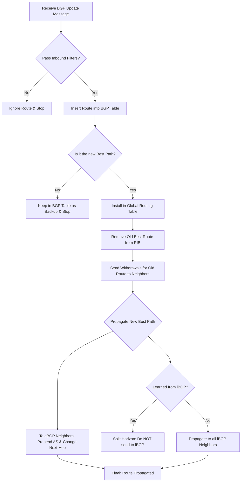

# Propagation of BGP routes

When a BGP router receives a new route in a BGP update message, it executes the following procedure - 

1. Inbound policy Check -- Checks all incoming filters defined for BGP session, if the route isn’t allowed through by one of the filters, it’s just ignored, and the procedure stops.

   - When a router receives an `UPDATE`message from a neighbor, the first line of defines is the *InBound policy* -- Administrators uses tols like `Route-maps, prefix-lists`or `AS-path`filters to control which routes are accepted.
   - Purposes -- prevents the acceptance of malicious or incorrect routes.
   - Traffic Engineering - influences inbound traffic paths by accepting only specific prefixes.
   - Result -- if rejected by a filter, it is discarded immediately.

2. Insert into BGP table -- 

   - Explanation -- passes the filters are stoed in the BGP table
   - The BGP Table is distinct from the global IP routing table. Acts as a dbs containing *all* valid paths learned from all neighbors, even if multiple paths exist for the same distination.

3. Execute BGP route-selection Alg -- Since BGP might learn multiple paths for the same destination (NLRI), it must select a single Best path.

   1. Weight
   2. Local Preference
   3. Locally Originaged
   4. AS Path
   5. Origin
   6. MED
   7. eBGP over iBGP

   Result if the new route is not superior to the existing best path, the process stops, the route remains in the BGP table as a backup but is not utilized or advertised.

4. Install in Global routing table -- 

   - Explanation -- once a route is crowned the Best path -- the router attempts to install into the RIB (Global Routing Table) for actual data forwarding
   - Precedence -- The route only written to the RIB if has a better `Administrative`Distance than the same prefix learned via other protocols (like OSPF or static routes)
   - Update -- If a previous BGP router for that destination existed in the routing table, it is replaced by the new best path.

5. Revoke old Route -- 

   - BGP is an incremental update protocol -- if the best path changes, the router must inform its neighbors that the previous info is no longer valid
   - Mechanism - the router sends a `Withdraw`message, without this, neighbors might continue sending traffic toward a stale or non-existent path, leadning to routing loops or *black holes*.

6. Propagate to External Neighbors (eBGP) -- 

   - Explanation -- The router advertises the new best path to neighbors in External Ases (eBGP)
   - Outbound Filtering -- before sending, Outbound policies are checked, FORE, an ISP might filter internal routes to prevent them from leaking to other providers
   - Attribute modification -- During this step, the router typically *prepends its own AS number to the As-PATH* and changes the Next-Hop to its own interface IP.

7. Propagate to Local AS - 

   - Core concept -- iBGP split horizon - A route learned from an iBGP neighbor must not be forwarded from an `eBGP`neighbor. it is advertised to all `iBGP`neighbors.
   - If the route was locally generated or learned from an eBGP neighbor, it is advertised to all iBGP neighbors
   - If the route was learned from an `iBGP`neighbor, it is not advertised further.



#### How BGP selects Routes

To be able to survive network outages, most networks running BGP connect to more than one other network. This means that many destination are reachable over two or even more BGP neighbors as long as their is no outages. Thus, BGP needs a mechanism to select the best router from the set of available routes from different neighbors.

##### Whey is route selection necessary -- 

- Redundancy & multi-homing -- Modern networks connect to mutiple ISPs or utilize multiple links to prevent outages.
- Path Coexistence - This routes in multiple entries for the same dest prefix within the BGP table
- Uniqueness Requirement -- The RIB typically only accepts one best path for data forwarding, BGP must battle out these cadidates to pick a winner.

Key Attributes -- 

- local Preference - within the iBGP, tell routers within the same AS which exit point is preferred to leave the network, most common tool for controlling outbound traffic, rule: higher better, and default is 100
- AS Path - A list of AS numbers the route has traversed
  - Loop Prevention
  - Selection
  - Policy
- Next Hop -- the IP used to reach the dest -- in eBGP this is the interface IP of the peer, in iBGP, this attribute does not change by default. The Naunce -- does not change by default as it moves through the AS.
- MED -- multi-Exit Discriminator -- 
  - Scope -- passed between adjacent Ases
  - Role -- Suggests to an Extenal AS which entry point they should use to enter your network
  - Rule -- lower is better
- Origin -- 
  1. i - routes advertised vis the network command
  2. e -- learned via the legacy EGP protocol, Rarely seen
  3. ? -- usually introduced via redistribution.

| Step | Attribute           | Rule             | Scope                               |
| ---- | ------------------- | ---------------- | ----------------------------------- |
| 1    | Weight              | Highest wins     | Local router only (Cisco private)   |
| 2    | Local Preference    | Highest wins     | Entire AS                           |
| 3    | Locally Sourced     | Local > Neighbor | Generated via `network`/`aggregate` |
| 4    | AS Path             | Shortest wins    | Global                              |
| 5    | Origin              | IGP > EGP > ?    | Global                              |
| 6    | MED                 | Lowest wins      | Between neighboring ASes            |
| 7    | External > Internal | eBGP > iBGP      | Prefer external paths               |
| 8    | IGP Metric          | Lowest wins      | Path to the BGP Next Hop            |
| 9    | Router ID           | Lowest wins      | Final tie-breaker                   |

## Failing inputs become static test cases

The fuzz target -- What do we do with this `f`parameter then -- call its `Fuzz`method -- passing it a certain function. Using `f.Fuzz`and the Fuzz target -- Call its `Fuzz`method and pass it a specific function.

In reality, this is the function that the fuzz testing machinery (the fuzzer) will repeatedly call. The fuzzer generates different random values and feeds them into this function. This is not the main function itself, it is the function we pass into `f.Fuzz`.

```go
func FuzzGuess(f *testing.F) {
	f.Fuzz(func(t *testing.T, n int) {
		guess.Guess(n)
	})
}
```

This simple target does nothing but call `Guess`with the generated input, could do more here. To keep simple for now, just call the function under test without checking the result. Just like:

```sh
go test -fuzz .
```

#### Failing inputs become static test cases -- 

```sh
go test # --- FAIL - panic
```

As it happens, there is only one such input at the moment - but it’s enough to fail the test.

##### Fuzzing a risky function -- 

The author proposes a function designed to return the first character of a string -- 

- Bug - treting a string as a slice of bytes `[]byte`and returning the first element.
- Consequence -- if the first character is a multi-byte unicode character, returning only the first byte results

Solution - Fuzz testing - Suggesting *fuzz tesing* as a tool to catch these errors -- by feeding the function random, automatically generated inputs, a fuzzer will eventually provide a multi-byte character that causes the *byte-index* logic to fail, thereby exposing the bug.

```go
func FuzzFirstRune(f *testing.F) {
	f.Add("Hello")
	f.Add("World")
	f.Fuzz(func(t *testing.T, s string) {
		got := runes.FirstRune(s)
		want, _ := utf8.DecodeRuneInString(s)
		if want == utf8.RuneError {
			t.Skip()
		}
		if want != got {
			t.Errorf("given %q (0x%[1]x): want '%c' (0x%[2]x)",
				s, want)
			t.Errorf("got '%c' (0x%[1]x)", got)
		}
	})
}
```

##### Adding training data with `f.Add()`

Give some starting inputs as hints, the fuzzer’s *corpus* is set of training data we give it, if like, can still fuzz even with an empty corpus -- it helps if we can provide a few example values for it to start with.

```go
f.Add("Hello")
f.Add("world")
```

Can call `f.Add`to add more example as many times as like -- Also note in this context, Training does not refer to training a *deep learning* learning model instead, it refers to providing a fuzzer with *seed data*

- Seed Corpus -- Data manually provided by the developer added via `f.Add()`in the code
- Generated Corpus -- Interesting inputs discovered automatically by the fuzzer during execution that trigger new code execution paths.

It helps if can provide a few examle values for it to start with -- while a fuzzer can start from 0 and generate random garbage, highly inefficient, providing seeds offers several advantage -- 

- Guiding the Direction -- If start with nothing, the fuzzer might spend millions of iterations just trying to randomly stumble upon a valid `<`.
- Increasing Coverage -- Fore, By providing seeds that covers different business logic -- Normal inputs, boundary values, special characters.

##### How the Fuzzer works: Mutation -- 

The fuzzer will then generate more inputs from them by mutating them randomly -- Mutation is the core mechanism of fuzzing. Once the fuzzer receives a seed like it doesn’t just test `Hello`it performs opeations such as.

```go
// Adding Seed Corpus
f.Add("Hello")  // Seed 1: A normal string
f.Add("world")  // Seed 2: Another normal string
f.Add("")       // Seed 3: Empty string (tests for null pointers/zero length)
f.Add("!@#$%")  // Seed 4: Special characters
```

- Step 1 -- The fuzzer executes the valus in `f.Add()`exactly as they are, acts as regression test
- Step 2 - The fuzzer generates thousands of variations based on these seeds try and crash the program.

##### The `Fuzz`test training workflow

Think of this process as biological evolution -- 

1. Creation - The developer acts as the creator, providing ancestors via `f.Add()`
2. Reproduction & Mutation -- the fuzzer generates countless offspring based on those ancestors.
3. Natrual selection - 
   - If an offspring hits a new code branch, the fuzzer deems it interesting and adds it to the corpus as a base for future mutations.
   - If an offspring Causes a Crash, the fuzzer alerts u -- this is your bug.

##### A more sophisticated fuzz target

For upper, suppose the fuzzer calls our fuzz target with some string that doesn’t contain valid runes. What will our oracle function `DecodeRuneInString`return in this case - The answer is the constant `utf8.RuneError`.

```go
func FirstRune(s string) rune {
    return 0
}
```

Finally, just like an in any tests, compare `want`and `got`-- and fail the test they are not equal -- the failure message is a little more complicated than any we’ve written so far -- like:

```go
t.Errorf("given %q (0x%[1]x): want '%c' (0x%[2]x)", s, want)
t.Errorf("got '%c' (0x%[1]x)", got)
```

So the failing input is `world`-- which was one of the cases we manually added to the corpus using `f.Add()`. 

```go
func FirstRune(s string) rune {
	return rune(s[0])
}
```

As sure U spotted right away, the slice index expression `s[0]`will panic when `s`is empty, and indeed that is what we are seeing -- fix this like:

```go
func FirstRune(s string) rune {
	for _, r := range s {
		return r
	}
	return utf8.RuneError
}
```

```sh
go test -fuzz . -fuzztime=10m
```

The aim of `fuzz`testing, is to fail to disprove the correctness of a function such as `FirstRune`for some reasonable period of time, while pointing to how hard we tried.

### Selecting rows

if want to get a particular row in Polars DF, can use the `row()`method and passing in a row number, fore, the Following statement retreives the first row in the table.

```python
df.filter(
	(pl.col('Company').is_in(['Toyota', 'Ford']))
)

df.filter(
	(pl.col('Company') == 'Toyota') &
    (pl.pol('Year')> 1980)
)

df.filter(
	~(pl.col('Company')=='Toyota')
)

df.filter(
	(pl.col('Company') != 'Toyota')
)
```

##### Selecting rows and columns

Now that U have seen show the use the `select()`method to select columns and the `filter()`method to select rows from a Polars DF. Let’s see how U can chain them together to select specific rows and columns.

```python
df.filter(
	pl.col('Company') == 'Toyoto'
).select (
	'Model'
)

df.filter(
	pl.col('Company') == 'Toyota'
).select(['Model', 'Year'])
```

##### Using SQL on Polars

While can use the various methods in Polars to select rows and columns from the DataFrame.