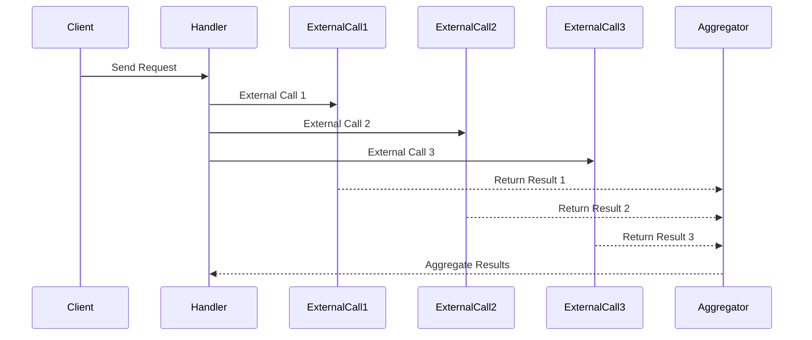

# Removing elements from an array

Can also remove a specific element from an array in Mongodb, typically, using `$pull`

```js
db.routes.updateOne(
    { "airline.id": 413, "src_airport": "DFW", "dst_airport": "LAX" },
    {
        $pull: { // operator name
            prices: {   // array fields name
                class: 'first',
                price: 2000
            }
        }
    }
)
```

And the `$pop`operator in MongoDB, which removes either the first or the last element of an array within an document. This operator is helpful when U need to remove elements from the end or the beginning - 

```js
db.routes.updateOne(
	{
        //... condition
    },
    {$pop: 
    	{price: 1} // note 1 for last, -1 for first
    }
)
```

Updating array elements -- When modify array with numerous elements, the proces become more complex if U need to alter specific items - 

##### direct indexing

If U know the *exact* index of the element in the aray -- like:

```js
db.routes.updateOne(
	{/*condition*/},
    {$set: {'price.1.price': 3500}} // also not index beginning from 0, so 2nd
)
```

##### Positional operator `$`

This is useful when don’t know the exact index of the element but can specify a condition that uniquely identifies it within the array -- just like:

```js
db.routes.updateOne(
	{/* conditions */,
    	// condition to identify the element note that
     "price.class": 'luxury'
    },
    {
        $set: {"prices.$.pirce": 4500}
    }
)
```

Also note that if the speified field does not eist within an array element that matches the condition, Mdb will *automatically* adds the `price`field to the elment and sets its value. This action occurs cuz the `$set`operator in Mdb not only updates existing fields but also creates new fields in docuemnt elements where they are missing.

##### Updating using array fitlers

Another option invovles the `$[<identiefer>]`operator -- known as the *filtered* positional operator -- For pinpointing operator -- offers a powerful capability in Mdb for pinpoinitng array elements that satisfy specified conditions. The point is using the `{arrayFilters: {<identifier>:<condition>}}` like:

```js
db.routes.updateOne (
	{
        // conditions
    },
    {
        $set: {
            "price.$[elem].price": 2600
        }
    },
    {
        arrayFilters: [ // note that it is an array
            {'elem.class': "business"}
        ]
    }
)
```

For this updating operation, targeting a specific rout with the airline using the `$[elem]`filtered positional operator along with the specified array filter. The identifier `elem`used with this acts as a *placeholder* that refers to specific elements within an array. This setup enables selective updating of array elements that meet defined criteria.

The special operator `$, $[], $[elem]`are used in Mongodb updated opereations to manipulate arrays, they differ primarily in how they target elements within the array for modification -- 

##### `$`(positional operator)

Acts as a placeholder for the *frist array element* that matches the `query criteria`specified in the `find`. fore:

```js
db.collections.updateOne(
	{
        //... conditions....others
        "items.name": "A"
    },
    {$set: {"items.$.qty": 50}}
)
```

##### `$[]`-- All position operator

- Usage -- used with field update operator like `$set, $inc`
- Every in the array specified by the field path
- performing the same update on every single element of an array field

```js
db.collections.updateOne(
	{_id: 1},
    {$inc: {"items.$[].qty": 1}} // increment qty for ALL items
)
```

##### `$[elem]` -- filtered positional operator

Act as a placeholder for all array elements that matches a specific condition defined in the `arrayFilters`option of the `update`operation.

- Require the `arrayFilters`option
- All elements in the array that satisfy the condition specified in the `arrayFilters`
- Define a variable in the `arrayFilters`that refers to array elements.

```js
db.collections.updateOne(
	{_id:1},
    {$set: {'item.$[item].price': 10}},
    {arrayFilters: [{'item.qty':0}]} // again,note that this is an array
)
```

## Using `sync.WaitGroup`correctly

`sync.WaitGroup`is a mechanism to wati for *n* operations to complete -- generally, use it to wait for `n`goroutines to complete -- `wg := sync.WaitGroup{}`. Internally, `sync.WaitGroup`holds an internal counter initialized by default 0 can increment this counter using the `Add(int)`method and decrement it using `Done()`or `Add`with an negative value. But if use it as:

```go
wg := sync.WaitGroup{}
var v uint64

for i:=0; i<3; i++ {
    go func() {
        wg.Add(1)
        atomic.AddUnit64(&v, 1)
        wg.Done()
    }()
}
wg.Wait()
fmt.Println(v)
```

For this, Go will even catch data race -- `wg.Add(1)`is called within the newly *created gorutine, not in the parent goroutine.* Hence, there is no guarantee that we hae indicated to the wait group that we want to wait for 3 goroutines before calling `wg.Wait()`. Just need to use it in the parent goroutine like:

```go
wg := sync.WaitGroup{}
var v uint64
wg.Add(3) 
for i:=0; i<3; i++ {
    go func(){...}()
}
// Or, can call wg.Add during each loop iteration before spinning up the child goroutines.
wg := sync.WaitGroup{}
var v uint64
for i:=0; i<3; i++ {
    wg.Add(1)
    go func() {
        //...
    }()
}
```

### Condition variables

```go
type Cond
func NewCond(L Locker) *Cond
func (c *Cond) Broadcast()
func (c *Cond) Signal()
func (c *Cond) Wait()
```

`Cond`implements a condition variable, a rendezvous point for gorotuines waiting for or announcing the occurrence of an event. A condition variable is a container of threads waiting for a certain condition In the example, the conditoin is a balance update fore:

```go
type Donation struct {
    cond *sync.Cond
    balance int
}

donation := &Donation {
    cond: sync.NewCond (&sync.Mutex{})
}

// Listener goroutines -- 
f := func(goal int) {
    donation.cond.L.Lock()
    for donation.balance< goal {
        donation.cond.Wait() // Wait() in mutex
    }
    fmt.Printf("%d$ goal reached\n", donation.balance)
    donation.cond.L.Unlock()
}
f(10)
f(15)

for {
    time.Sleep(time.Second)
    donation.Cond.L.Lock()
    donation.balance++
    dotnation.cond.L.Unlock()
    donation.cond.Broadcast()
}
```

Changing the Stingy goroutine is simpler cuz we only need to signal -- Every time we add monty to our shared `money`, need to signal by calling the `Signal()`function on the condition variable -- 

```go
func stingy(money *int, cond *sync.Cond) {
    for i:=0; i<1000000; i++ {
        cond.L.Lock()
        *money += 10
        cond.Signal()
        cond.L.Unlock()
    }
    fmt.Println(...)
}
```

#### Missing the Signal -- 

What happens if goroutine calls `Signal()`or `Broadcast()`and there is no execution waiting for it -- If there is no goroutine in a waiting state, the `Signal()`or `Broadcast()`call will be missed -- namely if a goroutine is waiting on `c.Wait()`, but the corresponding `c.Signal()`or `c.Broadcast()`is missing or called incorrectly, the waiting will block.

##### Best practice to prevent missing signals

1. Use a `for`loop for `Wait()`-- Waiting goroutines must check the shared predicate in a `for`loop. This protects against spurious wakeups and ensures the condition is still `true`after re-acquiring the lock.

   ```go
   c.L.Lock()
   for !condition {
       c.Wait() // block and wait
   }
   c.L.Unlock()
   ```

2. Acquire Lock before modifying and signaling -- or when holding the lock

   The goroutine changing the shared predicae *must hold the lock* while making the change. It can then call `Signal()`or `Broadcast()`while holding the lock or immediately after releasing the lock -- fore:

   ```go
   // Signaling goroutine
   c.L.Lock() // acquire
   condition = true
   c.L.Unlock() // release
   c.Signal()
   ```

3. Using `Broadcast()`over `Signal`if multiple goroutines needs to wake.

So, for the `sync.Cond`-- A condition variable is a conainer for goroutines waiting for a particular condition -- `Wait`must be called while holding `c.L`-- the same Lock should be used to protect the condition associated with the condition variable.

### using `errGroup`

`golang.org/x`is a repository providing extensions to the stdlib -- the `sync`sub repository contains a handy package -- `errgroup`-- 



For this case of one error during a call, want to return it -- in case of multiple errors, want to return only one of them -- write the skeleton of the imp using only the std concurrency primitives -- like:

```go
func handler(ctx context.Context, circles []Circle) ([]Result, error) {
    results := make([]Result, len(circles))
    wg.Add(len(results))
    
    for i, circle := range circles {
        i := i
        circle := circle // when use goroutine
        go func() {
            defer wg.Done()
            result, err := foo(ctx, circle)
            if err != nil {
                //... ? how to handle
            }
            //...
        }()
    }
    wg.Wait()...
}
```

Decided to use a `sync.WaitGroup()`to wait until all the goroutines are completed and handle the aggregations in a slice. Another way would be to send each practial result to a channel and aggregate them in another goroutine.

Namely, what if `foo`-- the call made within a new goroutine returns an error -- how should we handle it -- there are various options -- like -- 

- Use a named `results`slice -- have a slice of errors shared among the goroutines -- each goroutine would write to this slice in case of an error. would have to iterate over this slice in the parent goroutine to determine whether an error occurred
- Could have a single error variable accessed by the goroutines via a shared mutex.
- Sharing a channel of errrors.

Regardless of this options -- starts to make the solution pretty complex -- for that reason -- the `errgroup`package was designed and developed - exports a single `WithContext()`function that returns a `*Group`struct given a context -- this struct provides sync, error propagation, and context cancellation for a group of goroutines and exports only two methods - 

- `Go`to trigger a call in a new goroutine
- `Wait`to block until all the goroutines have completed. it returns the first *non-nil* error, if any.

```sh
go get golang.org/x/sync/errgroup
```

```go
func handler(ctx context.Context, circles []Circle) ([]Result, error) {
    results := make([]Result, len(circles))
    g, ctx := errgroup.WithContex(ctx)
    
    for i, circle := range circles {
        i := i
        circle := circle
        g.Go(func() error {
            result, err := foo(ctx, circle)
            if err != nil {
                return err
            }
            results[i]= result
            return nil
        })
    }
    if err := g.Wait(); err != nil { // calls g.Wait() for all the gorotuines to complete
        return nil err
    }
    return results, nil
}
```

In each iteration, used g.Go() to trigger a call in a new goroutine -- this method takes a `func() error`as an input, with a closure wrapping the call to `foo`and handling the result and error.

For an example just like:

```go
func main() {
	// create the group and a derived context
	ctx, cancel := context.WithTimeout(context.Background(), 5*time.Second)
	defer cancel()
	g, ctx := errgroup.WithContext(ctx)

	// Task 1, Runs for 3 s and is successful
	g.Go(func() error {
		select {
		// cuz 2s complete, so successfully
		case <-time.After(2 * time.Second):
			fmt.Println("Task 1 finished successfully")
			return nil
		case <-ctx.Done():
			fmt.Println("Task 1 canceled early")
			return ctx.Err()
		}
	})

	// Task 2, fails immediately after 1s
	g.Go(func() error {
		time.Sleep(3 * time.Second)
		fmt.Println("Task 2 ok, triggering cancellation.")
		return fmt.Errorf("task 2 failed due to database error")
	})

	// task 3, runs for 5 s, but will be canceled --
	g.Go(func() error {
		select {
		case <-time.After(5 * time.Second):
			fmt.Println("Task 3 finished successfully")
			return nil
		case <-ctx.Done():
			fmt.Println("Task 3 canceled early")
			return ctx.Err()
		}
	})

	// Wait for all finish
	if err := g.Wait(); err != nil {
		fmt.Printf("❌ An error occurred: %v\n", err)
		return
	}
}
```

For the Fan-out and Fan-in options, just like -- 

```go
func downloPages(quit <-chan struct{}, urls <-chan string) <-chan string {
    pages := make(chan string)
    go func() {
        defer close(pages)
        moreData, url := true, ""
        for moreData {
            select {
            case url, moreData = <-urls:
                if moreData {
                    resp, _ := http.Get(url)
                    if resp.StatusCode != 200 {
                        panic(...)
                    }
                    // read all remaining data from the io.Reader
                    // until it hits the EOF or encounters an error
                    body, _ := io.ReadAll(resp.Body)
                    pages <- string(body)
                    resp.Body.Close()
                }
            case <-quit: 
                return
            }
        }
    }()
    return pages
}
```

##### Alternative for large data -- 

If are dealing with very large files or strems where reading the entire content into memroy -- should use alternavives

- Iterating reading -- use the basic `r.Read()`with a loop until `io.EOF`is returned
- `bufio.Scanner`
- `io.Copy`-- usd to efficiently stream data from one `io.Reader`directly to an `ioWriter`

