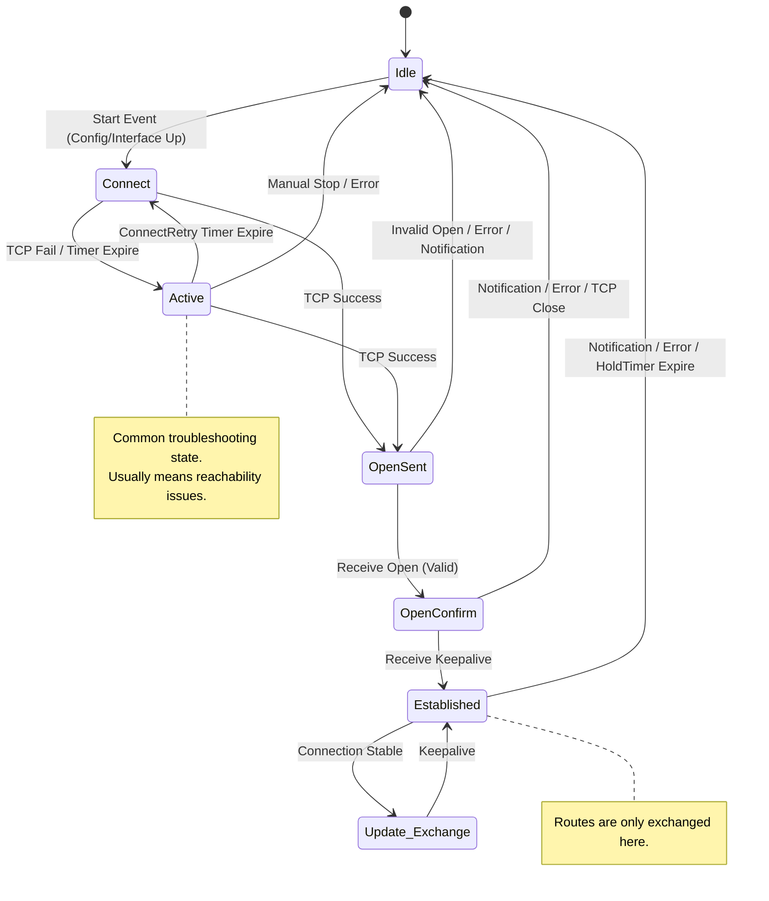

# Using DuckDB with Polars

`Polars`- high-performance alternative designed for modern, large-scale data tasks -- While Pandas is the industry standard for smaller, in-memory datasets -- it often struggles with speed and memory when execeeds available RAM. Polars addresses there bottlenetcks by reimagining how a DataFrame library should function in a multi-core environement -- 

| Feature     | Pandas                                       | Polars                                                   |
| ----------- | -------------------------------------------- | -------------------------------------------------------- |
| Language    | Built on Python/NumPy (C/C++).               | Written entirely in Rust for maximum speed.              |
| Execution   | *Eager*: Runs every line immediately.        | *Lazy*: Optimizes the entire query before running.       |
| Parallelism | Mostly single-threaded (uses one CPU core).  | *Multi-threaded*: Scales across all available CPU cores. |
| Memory      | Row-based/Python objects (memory intensive). | Columnar (Apache Arrow): Highly memory efficient.        |

Since Pandas 2.0, Pandas has introduced significant support for columnar storage by integrating the Apache Arrow backend. While pandas has historically been built on Numpy -- the latest versions allow U to use Arrow to store data in a truely columnar format.

Polars is a DF library that is completely written in Rust -- Polars is designed with the following in mind -- 

- *speed* -- polars leverage URST, for its performance
- *parallelism* -- Polars can take advantage of multi-core processors -- which provides substantial speed improvements for CPU-bound operations.
- *Memory efficientcy* -- Lazy evaluation, which means an operation is not performed until it is needed, in addition, queries can be chained and optimized before execution, resulting in much efficient execution.
- *Efficient storge of data* -- Polars stores data in column format, which is more efficient than the row-based storge in pandas.
- *Ease of use* -- Polars supports a SQL-like syntax for data manipulation, making it immediately accessible to a large group of users.

#### Creating a Polars DF - 

Create a Polars DF using a Python dictionary -- the following code snippet creates a DF containing 6 columns and 8 rows - just like: 

```sh
pip install polars-lts-cpu # for this old CPU
```

```python
df = pl.DataFrame(
    {
        "Model": [
            "Camry",
            "Corolla",
            "RAV4",
            "Mustang",
            "F-150",
            "Escape",
            "Golf",
            "Tiguan",
        ],
        "Year": [1982, 1966, 1994, 1964, 1975, 2000, 1974, 2007],
        "Engine_Min": [2.5, 1.8, 2.0, 2.3, 2.7, 1.5, 1.0, 1.4],
        "Engine_Max": [3.5, 2.0, 2.5, 5.0, 5.0, 2.5, 2.0, 2.0],
        "AWD": [False, False, True, False, True, True, True, True],
        "Company": [
            "Toyota",
            "Toyota",
            "Toyota",
            "Ford",
            "Ford",
            "Ford",
            "Volkswagen",
            "Volkswagen",
        ],
    }
)
```

And just like Pands DataFrame, Jupyter Notebook will pretty-print the polars DataFrames when you print it out. Fore, to display the full name of the data of each column in the Polars DF, use the `dtypes`property -- like:

```python
df.dtypes
df.rows() # returned as a list of tuples
```

##### Selecting columns -- 

To select a particular column in the DF, using the `select()`method -- just like:

```python
df.select('Model')
```

Well, `df[‘Model’]`works just like using the `select()`method. Howver, the Polars documentation specifically mentions that the square bracket indexing method is an anti-pattern for Polars cuz it is sometimes consusing. Fore, if need to retrieve more than one column, enclosing the column names in a list -- like:

`df.select(['Model', 'Company'])`

And if want to retrieve all the string column in the DF, you can use the expressoin with the `select()`method like:

```python
df.select(pl.col(pl.String)) # retrieve all string columns
```

For this, the statement `pl.col(pl.String)`is known as an exression in Polars. Can also pipe together multiple expressions -- like:

```python
df.select(
    pl.col(['Year', 'Model', 'Engine_Max'])
    .sort_by(['Engine_Max', 'Year'], descending=[False, True])
)
```

Can also group multiple expression in a list. Fore the following code snippet lists all the string columns plus the `Year`column. like:

```python
df.select(
    [pl.col(pl.String), 'Year']
)
```

#### Selecting rows

If Want to get a particular row in Polars DF, can use the `row()`method and pass in row number. Fore, the following statement retreives the first row in the table like:

```python
df.row(0)
df[1:3]
```

Note that instead of using square bracket indexing, Polars encourages the use of more explicit forms of querying and functions to manipulate data -- In the real wold, often retreive rows based on certain criteria, instead of specific row numbers -- Despite this, Polars still provides support for square bracket indexing. Recommnds using the `filter()`method wit hthe following expression. like:

```python
df.filter(
    (pl.col('Company')=='Toyota') | (pl.col('Company')=='Ford')
) # need to note the () |() is needed

# and match multiple brands of cars it is easier to use the `is_in()` method like -- 
df.filter(
    (pl.col('Company').is_in(['Toyoto', 'Ford']))
)

df.filter(
    (pl.col('Company') == 'Toyota') &
    (pl.col('Year') > 1980)
)
```

## BGP States

The BGP RFC has a list of specific states a session may be in, as well as a state transition diaram. The behavior of the router is bound by the state a BGP session is in. Also the BGP MIB defines an SNMP trap message that can be sent when a session oes from a *higher* state into a *lower* state. Describe the core mechanism of BGP -- the *Finite State Mechine* - FSM -- unlike static routing, BGP relies on a regorous processs to establish and maintain sessions with neighbors (Peers).

1. Idle -- The initial and stopped state of BGP
   - In this, process may be enabled, but refuses all incoming connection attempts, waiting for a *start event*.
   - Using the following -- An administrator enters `neighbor x.x.x.x remote-as <ASN>`command
   - A phycial or logical interface goes up
   - The BGP process is manually reset
   - Once start event occurs, the router initializes reources, resets the *connectRetry timer*.
   - next step -- once a start event occurs, the router initializes resources resets the *Connectiontry timer*. initiate a TCP connection, and transitions to `Connect`.
2. Connect -- 
   - BGP is attempting to establish a TCP connection 3-way handshake
   - Router behavior -- 
     - Active -- Sends TCP SYN packet to the neighbor to initiate the connection
     - Passive -- also listens for incoming TCP connection requests from the neighbor.
     - Branching paths -- 
       - If router sends an open message transitions to *OpenSent*
       - If TCP fails, the router does not give up, it transitions to Active to continuing retrying.
3. Active -- does not mean *successful* or *Working* -- actually means TCP connection failed, actively retrying
   - Route behavior -- the router is reactively trying to re-initiate the TCP connection
   - Common Root causes -- if session is stuck in Active, it usually means
     - The neighbor is unreachable
     - TCP port 179 is blocked by a firefall or ACL
     - Configuration error
   - Next step -- 
     - Success -- If TCP finally connects, sends an open message and transitions to *OpenSent*.
     - Failure -- if the retry timer expires again, may fall block to `Connect`to Idle
4. OpenSnet - TCP connection is established, and the local router has sent its introduction letter to the peer.
   - Router behaviro -- 
     - Router is waiting to retreive an Open Message from the neighbor.
     - Open received - router checks the paramemters for validity (AS Number match, BGP verson consistency, Router iD conflicts, authentication/password, etc.)
   - Next step -- 
     - Validate parameters -- Sends a *keepalive* message to confirm acceptance and transition to *openConfirm*.
     - Invlid parameters - Sends a *Notification* message, closes the TCP connection, and return to `Idle`.
5. OpenConfirm  -- Both parties have exchanged introductions and aggreed on each other’s parameters.
   - Router behaviors -- 
     - Router is waiting for a *keepalive* message from the neighbor
     - Reactiving a keepalive confirms that a neighbor also acceped my parameters and the negotiation is complete.
   - Next -- 
     - Receive Keepalive -- Trnsition to established
     - Reactive Notification/TCP Disconnection return to `Idle`.
6. Established -- The final, stable state, Only at this stage is the BGP neighbor relationship fully formed.
   - Begins exchanging Update messages
   - Sends periodic keepalive messages to maintain the session
   - If an error occurs, sends a Notificaiton message and drops the session.
   - About SNMP traps -- Are typically triggered when a session drops from Established back to Idle, connect or active, this is the primary signal used by netwok monitoring systems to detect BGP failure.

The summary --  To summary checklist

1. Idle -- powered off/waiting to start
2. Conenct -- Trying to start the TCP handshake
3. Active -- TCP failed trying again
4. OpenSent - TCP is up I sent my intro and am waiting for yours.
5. OpenConfirm -- liked your intro and am waiting for your handshake
6. Established - Handshake complete -- exchange routes.

stateDiagram-v2
    [*] --> Idle
    



Lifecycle of a BGP route, structured into 3 disintct phases, Input processing, Decision/installation and propagation.

##### 1. Incoming Filter Check

- **Context:** The router checks all inbound filters defined for that specific BGP session. If a route is filtered out, the process terminates immediately.
- **Technical Detail:** This is the first line of defense. Engineers use ***Prefix-lists, Route-maps*,** or **AS-Path filters** to define these rules.
- **Purpose:** To prevent "garbage routes" (e.g., private addresses like 192.168.x.x), prevent route leaks, or enforce business policies (e.g., rejecting routes from a competitor).
- **Result:** If a route is **denied**, it is silently dropped and does not consume BGP table memory.

##### 2. Insertion into BGP Table

- **Context:** Validated routes are inserted into the BGP Table.

- **The BGP Table (RIB-Local):** This is BGP’s private database, separate from the global IP routing table. It stores all valid routes learned from all neighbors.

- **Note:** At this stage, a router may have multiple paths to the same destination (e.g., one from ISP-A and one from ISP-B). Both are stored here, waiting for the "Best Path" competition.

- **RIB** -- software dbs in the router’s RAM that stores all available routing information discovered by various routing protocols, static routes, and directly connected routes.

  - Versatility -- The RIB protocol-agnositc -- if run OSPF and BGP simutaneously, both protocols will sumit their disovered paths to the RIB.

  - The Decision Center -- When multiple protocols disover a path to the same destination, the RIB uses Administrative Distance (AD) to select the best path and marks as Optimal or Best.

  - RIB vs. FIB -- 

    RIB -- Thinks of this as the router’s Brain -- it is responsible for calculation, comparison, and storage, resides in the RAM controlled by the main CPU.

    FIB - Data Plaine -- Standing for Forwarding info Base -- Teh FIB is the Action part, the best routes selected by the RIB are programmed into the FIB.

| **Name**        | **Meaning**            | **Description**                                              |
| --------------- | ---------------------- | ------------------------------------------------------------ |
| **Adj-RIB-In**  | Adjacency RIB Inbound  | Stores raw, unfiltered routes received from a neighbor.      |
| **Loc-RIB**     | Local RIB              | Stores routes that passed inbound filtering and won the BGP Best Path algorithm. |
| **Adj-RIB-Out** | Adjacency RIB Outbound | Stores routes selected to be advertised to a specific neighbor (after outbound filters). |

*The RIB is the sum of a router's routing intelligence*. Only routes that win the competition within the RIB (based on AD values) are promoted to the FIB to become actual forwarding instructions.

