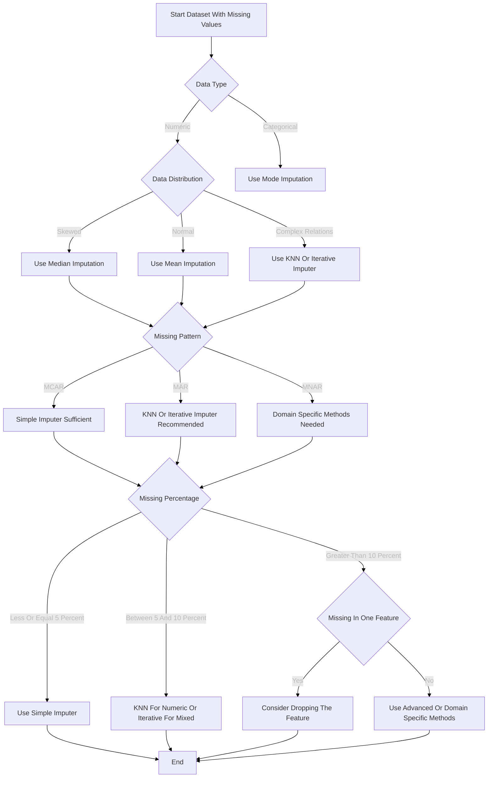
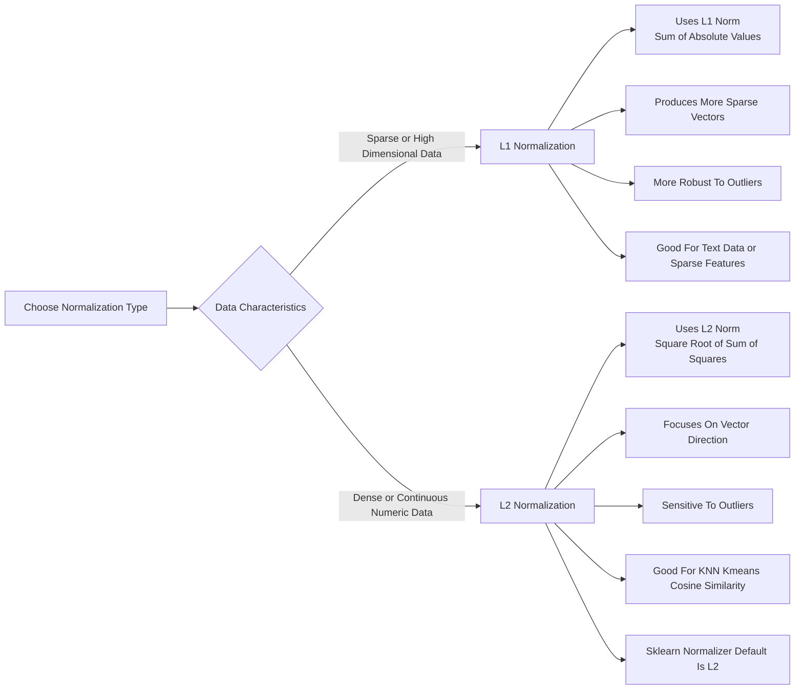

# Using `IterativeImputer()`class 

Offers an advanced apporach by modeling each feature with missing values as a function of other features in a Round-robin fashion. Fills in missing values with *multivariate regression* + robin-hood and smarter than simple mean/median filling -- 

- Treat each feature with missing values as a regression of the `y`.
- Treat other features as `X`.
- The regression model is used to predict the missing value of the feature.

##### Why more accurate -- 

- It takes advantage of multivariate rels
- Instead of just looking at the statistics of individual features, infer missing values based on patterns in other features.
- Therefore, it usually maintain data structures better then mean, median, KNN...

IterativeImputer leverages multivariate relationships for more accurate imputation by *establishing a regression model for each feature* and taking turns predicting missing values.

```python
# epperimental feature requires loading
from sklearn.experimental import enable_iterative_imputer
from sklearn.impute import IterativeImputer

iterative_imputer = IterativeImputer()
iteraive_imputed_data = iterative_imputer.fit_transform(df)
pd.DataFrame(iteraive_imputed_data, columns=df.columns)
```

| Missing proportions | Recommended method                                           | Description                                               |
| ------------------- | ------------------------------------------------------------ | --------------------------------------------------------- |
| **≤ 5%**            | SimpleImputer（mean/median/mode）                            | ast, lightweight, and small deviation                     |
| **5–10%**           | KNNImputer (full value) IterativeImputer                     | It can use multi-feature relationships for better results |
| **> 10%**           | If you are focused on a single feature: consider *removing* the feature And  If it must be retained: *Domain-specific* methods are required | Conventional imputation may introduce large deviations    |



Fore, use `most_frequently`like:

```python
from sklearn.impute import SimpleImputer
imputer = SimpleImputer(strategy='most_frequent')
X_filled = imputer.fit_transform(X)
```

### Scaling techniques

When working with datasets, features can have vastly different scales -- fore, a feature representing age may range from 0 to 100, while anohter from 0 to 100,000. Without scaling, some algs will be dominated by *large-scale features* leadint to model learning bias. Fore, KNN, *K-means*, Linear regressin, Logistic regression, SVM and NN.

##### Standardization - Z-score transformation

Transform data to -- *mean=0* and, *standard deviation =1*, cuz std diviation is a measure of the degree of dispersion of a set of values -- 
$$
z = \frac{x - \mu}{\sigma}
$$
After the transformation, the std deviation = 1 has the following core meaning -- 

- Data may have negatie values
- Data distribution doesn’t have to be in a fixed range
- Most ML models work
- Linear models, SVMs, NN.

About 68% of the data is spared [-1, 1] between z scores, About 95% of the data is distributed [-2, 2] between z score. 

```python
from sklearn.preprocessing import StandardScaler
scaler = StandardScaler()

scaled_data = scaler.fit_transform(iteraive_imputed_data)
scaled_df = pd.DataFrame(scaled_data, columns=iterative_imputed_df.columns)
scaled_df
```

##### `MinMaxScaler()`

$$
x' = \frac{x - X_{\min}}{X_{\max} - X_{\min}}
$$

Here, `x`is original value and `Xmin`and `Xmax`are the minimum and maximum values of the feature respectively. 

```python
from sklearn.preprocessing import MinMaxScaler

minmax_scalar = MinMaxScaler()
minmax_scaled_data = minmax_scalar.fit_transform(iterative_imputed_df)
minmax_scaled_df = pd.DataFrame(minmax_scaled_data, 
                             columns = iterative_imputed_df.columns)

minmax_scaled_df
```

When to use `MinMaxScaler`-- Prioritize in the following situations `MinMaxScaler`-- 

1. The Alg requires the input to be bounded
   - DL often prefer inputs between [0, 1] cuz this helps gradient descent alg converage faster and works better when activation functions.
   - Image processing -- pixel intensity typically ranges from 0-255, divded 500, which is essentially `MinMaxScalar`.
2. The idata distribution is not a nomal distribution - If the distrubion of the data is very mxied, may not be appropriate to force the user of a `StandardScalar`and `MinMaxScalar`is safer choice.
3. Sparsity needs to be maintained -- 
   - If the input data is sparse matrix -- the `MinMaxScalar`can keep the 0 value unchanged. The `StandardScalar`substracts the mean, causing the original 0 to become a non-zero number.

When should not use `MinMaxScalar`-- 

- When the data contains outliers.

##### `Normalizer()`

`Normalization`scales individual samples to have the unit norm. This technique is particularlly useful when dealing with sparse when U want to treat each sample equally regardless of its magnitude -- the formula for L1 and L2 normalization, respectively -- as
$$
x_i' = \frac{x_i}{\sum_{j=1}^{n} |x_j|}
$$
Each element is divided by the sum of the absolute values of all elements in that sample. Or using L2 normalization:
$$
x_i' = \frac{x_i}{\sqrt{\sum_{j=1}^{n} x_j^2}}
$$

- L1 makes the sum of the abs values of the sample 1
- L2 makes the Euclidean length of the sample 1
- `Normalizer()`is normalizing samples, not features.

```python
from sklearn.preprocessing import Normalizer

normalizer = Normalizer() # default is L2 mode
normalized_data = normalizer.fit_transform(iterative_imputed_df)
normalized_df = pd.DataFrame(
    normalized_data,
    columns = iterative_imputed_df.columns
)
normalized_df
```

flowchart TD



## Executing multiple statements -- 

Having multiple statements in the same call is supported by the pq driver, so long as the statements do not contain any placeholder parameters. If they do contain any *placeholder parameter*.

